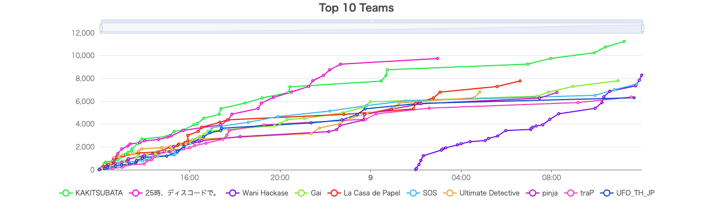
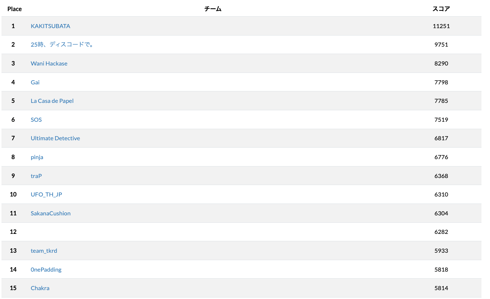
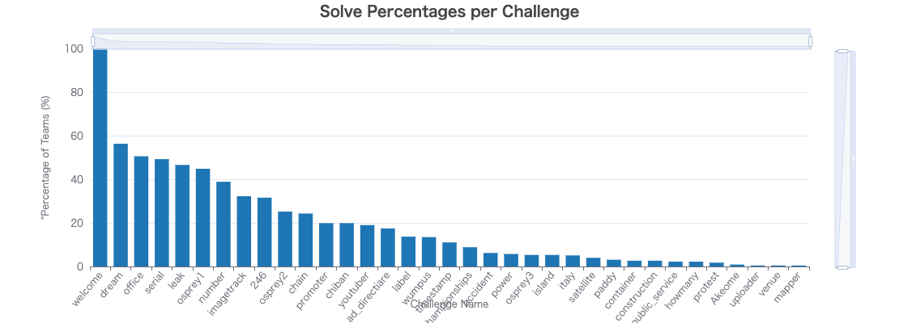
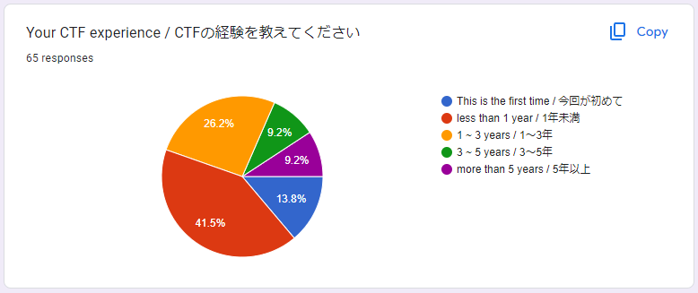

# DIVER OSINT CTF 2024

## Official Writeups

### geo

- [power](./geo/power/README.md)
- [chiban](./geo/chiban/README.md)
- [imagetrack](./geo/imagetrack/README.md)
- [public_service](./geo/public_service/README.md)
- [championships](./geo/championships/README.md)
- [construction](./geo/construction/README.md)
- [island](./geo/island/README.md)

### crypto

- [Akeome](./crypto/Akeome/README.md)
- [leak](./crypto/leak/README.md)

### transportation

- [accident](./transportation/accident/README.md)
- [container](./transportation/container/README.md)
- [italy](./transportation/italy/README.md)
- [youtuber](./transportation/youtuber/README.md)

### history

- [protest](./history/protest/README.md)
- [paddy](./history/paddy/README.md)
- [promoter](./history/promoter/README.md)

### misc

- [label](./misc/label/README.md)
- [wumpus](./misc/wumpus/README.md)
- [number](./misc/number/README.md)
- [howmany](./misc/howmany/README.md)
- [timestamp](./misc/timestamp/README.md)

### military

- [osprey3](./military/osprey3/README.md)
- [osprey2](./military/osprey2/README.md)
- [osprey1](./military/osprey1/README.md)
- [satellite](./military/satellite/README.md)

### introduction

- [Office](./introduction/Office/README.md)
- [chain](./introduction/chain/README.md)
- [246](./introduction/246/README.md)
- [ad_directiare](./introduction/ad_directiare/README.md)
- [dream](./introduction/dream/README.md)
- [serial](./introduction/serial/README.md)

### investigation_request

- [uploader](./investigation_request/uploader/README.md)
- [mapper](./investigation_request/mapper/README.md)
- [venue](./investigation_request/venue/README.md)

## 統計情報

* user: 873
* team: 512
* challenges: 35

