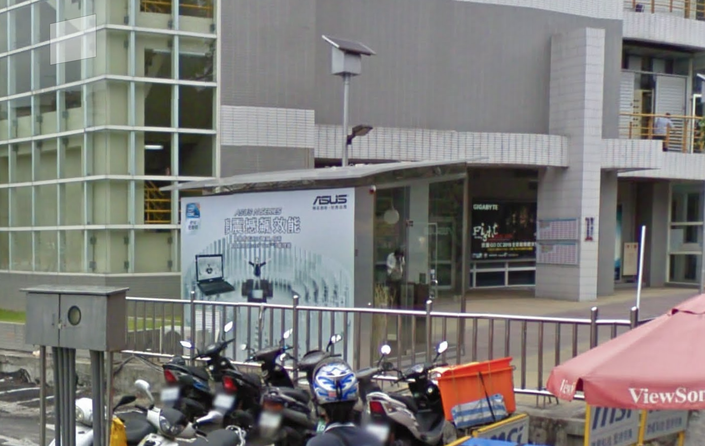

# championships

## 問題文

2010年10月、この場所には大会の広告が貼られていた。その大会の優勝者のニックネームを答えよ。  
Flag形式: `Diver24{優勝者のニックネーム}`  

In October 2010, an advertisement for a competition was placed at this location. Give the nickname of the winner of that tournament.  
Flag format: `Diver24{winner's nickname}`.

## 難易度

medium / 440 point (40 solves)

## 解法

クリックで表示

まず、画像には「歡迎蒞臨光華商場」と書かれているため場所を調べます。

場所は[この記事](https://www.fbnews.jp/202002/Taiwanakiba/)に記載されている通り、「光華商場」です。「歡迎蒞臨光華商場」とは「光華ショッピングモールへようこそ」という意味であるようです。

この場所をGoogle Mapで調べると[この位置](https://www.google.co.jp/maps/@25.0447935,121.53154,3a,75y,19.46h,110.74t/data=!3m6!1e1!3m4!1sTES9f6cDYwwBJXfS98Tumg!2e0!7i16384!8i8192?hl=ja&entry=ttu)が得られます。

Googleストリートビューの設定を2010年に変更して確認すると、「GIGABYTE」「Fight」と書かれた広告が貼られているのが確認できます。文字が読みにくい場合は似た単語をいくつか調べると良いでしょう。

「GIGABYTE Fight winner」というキーワードで2011/1/1以前の記事を設定して検索すると、[この記事](https://www.hardwarezone.com.sg/feature-live-taipei-gigabyte-open-overclocking-championship-2010/and-its-heating)がヒットします。この記事は大会終了2時間前の上位チームの名前が書かれています。この時点で1位は「Matose」であることがわかります。

期間を指定せずに「GIGABYTE 2010 Matose」などで検索すると、[この記事](https://www.techpowerup.com/131635/matose-wins-gigabyte-go-oc-2010)がヒットし、最終的な結果が書かれています。

**Diver24{Matose}**

この問題は、Google 検索およびGoogleストリートビューから過去の情報を得る方法を知ってほしいという意図で作成されています。

