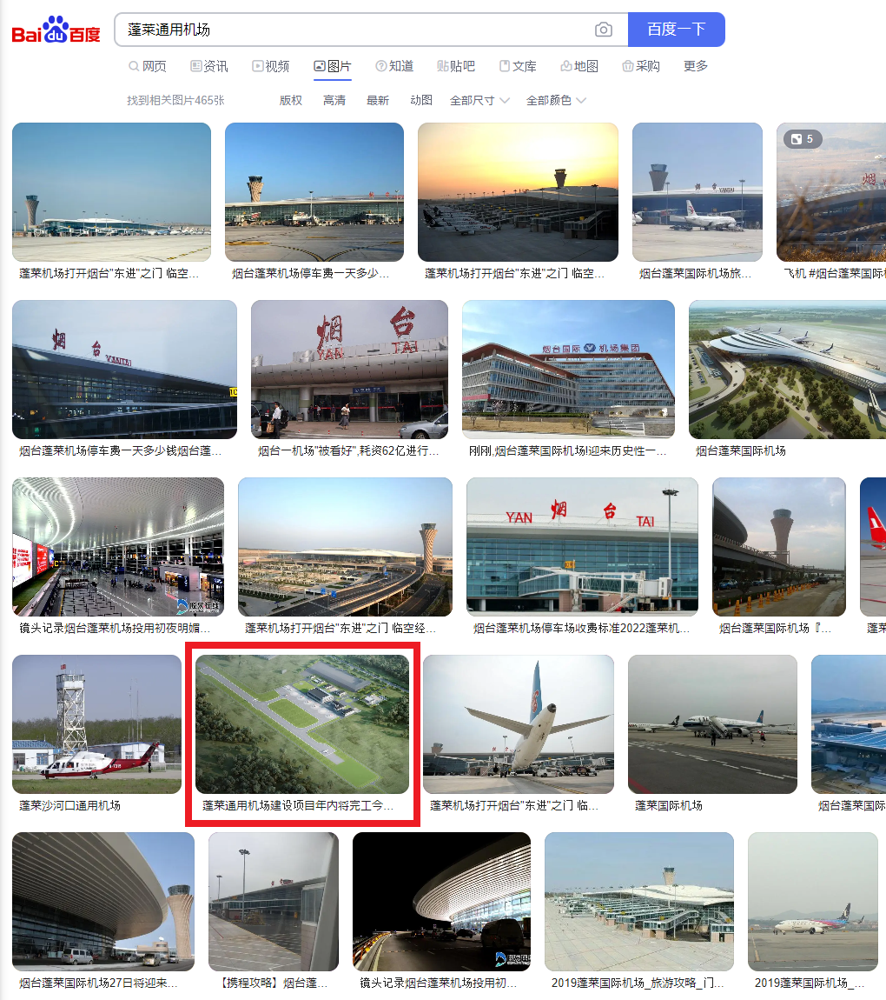

# construction

## 問題文

あるアナリストによると、37.669, 120.691 付近に新たな施設が建設されたことが判明した。この施設の名称を答えよ（現地の公用語表記）。  
例えば、韓国にある「青瓦台」が答えの場合、現地語表記を用いて `Diver24{청와대}` がFlagとなる。

One analyst found that a new facility was built in the vicinity of 37.669, 120.691. Give the name of this facility (in the local official language).  
For example, if the answer is "Cheongwadae" in South Korea, the Flag is `Diver24{청와대}` using the local language notation.

## 難易度

hard / 496 point (12 solves)

## 解法

クリックで表示

37.669, 120.691 をGoogle Mapsで確認すると、中華人民共和国 山東省 煙台市 蓬莱市 北溝鎮 付近であるとわかります。しかし、Google Maps の衛星画像ではこの地域に何か建設されたことが分かりません。また、中国大手のBaidu Mapの衛星画像でも同様です。

つまり、衛星画像の更新が間に合わない程、ごく最近に建設された可能性が否定できません。このようなケースでは、鮮度の高い衛星画像を入手する必要があります。
鮮度の高い（更新頻度の高い）衛星画像サービスとしてはMaxarやPlanetがその代表例ですが、これらは高額かつ契約が必要です。しかし、低解像度でもよければ欧州宇宙機関（ESA）のSentinel-2が利用できます。

[Sentinel-2の画像をEO Browserで確認](https://apps.sentinel-hub.com/eo-browser/?zoom=16&lat=37.66774&lng=120.68818&themeId=DEFAULT-THEME&visualizationUrl=https%3A%2F%2Fservices.sentinel-hub.com%2Fogc%2Fwms%2F42924c6c-257a-4d04-9b8e-36387513a99c&datasetId=S2L1C&fromTime=2023-09-13T00%3A00%3A00.000Z&toTime=2023-09-13T23%3A59%3A59.999Z&layerId=1_TRUE_COLOR&demSource3D=%22MAPZEN%22)してみましょう。遡ってみると2022年末の時点で空港らしきものが確認できます。EO Browserの距離測定機能を用いると、滑走路が800～900mほどであるため、小規模な空港であると分かります。

一旦、情報を整理しましょう。

- 当該の施設は空港である。滑走路は約800～900m程度のものが1本だけ存在しており、小規模な空港である。
- 2022年末ごろには少なくとも滑走路や駐機場の工事がほぼ完了し、それ以降に大きな変化はないように見える（ターミナルについては不明）。
- 翻訳サイトで「空港」を中国語訳すると `机场` 、「建設」は `建造` であると分かる。
- 現地の地名を確認すると `北溝鎮, 中華人民共和国 山東省 煙台市 蓬莱市` となっている。

Baidu で `煙台 机场` `蓬莱 机场 建造`などで検索すると、`烟台蓬莱国际机场`（煙台蓬莱国際空港）の記事ばかりがヒットします。[滑走路が3400mである](https://en.wikipedia.org/wiki/Yantai_Penglai_International_Airport)など、条件に合致しません。

ノイズが多い状況では、検索ワードの工夫が必要になります。small airportを中国語訳した `小机场` というワードを用い、 `蓬莱 小机场` などとBaiduでの検索ワードを工夫してみましょう。すると、「蓬莱通用机场」という情報がちらほら現れるようになります。

`蓬莱 小机场` あるいは `蓬莱通用机场` で画像検索も試すと、 「**蓬莱通用机场**建设项目年内将完工今天蓬莱区」という説明と共に、滑走路と駐機場の配置が衛星画像とほぼ一致する空港の画像（建築パース）がヒットします。

念のため `蓬莱通用机场 800m` `蓬莱通用机场 900m`などでBaidu検索すると、現地行政による[公文書](https://www.yantai.gov.cn/attach/0/e26981c1b0a04a03bf3453ac84a988d6.pdf)もヒットします。
この中で `蓬莱通用机场址位于蓬莱市小门家镇炉上村北` という記述がありますが、`炉上村`という地名はGoogle Mapsからも確認でき、確かにこの地の北に空港が建設されていることが確認できます。

**Diver24{蓬莱通用机场}**

本問では、Google Mapsに掲載されていない情報を、衛星画像や現地語の翻訳を駆使して突破してもらうことを狙いとしています。

ウクライナや南スーダン、ガザなどの情勢においては、Sentinel-2を使用した分析が盛んに行われています。EO Browserは実用性が極めて高いツールであるため、覚えておいて損はありません。

- [衛星画像から見えるカホウカダム破壊後の異変 ダム上流では水域の減少も](https://news.yahoo.co.jp/expert/articles/48a896ae4fa25ec059441ff0a1430b9a61275877)
- [ウクライナ東部の穀倉地で７月に火災頻発、１日１００件超も…人工衛星の画像分析で明らかに（読売新聞）](https://www.yomiuri.co.jp/science/20220926-OYT1T50143/)
- [ガザに軍用道路整備　ハマス包囲、逃走阻止が目的か―イスラエル（時事通信）](https://www.jiji.com/jc/article?k=2023120700889)
- [Using Sentinel-2 data to detect and document an incident in Khartoum, Sudan.](https://osintteam.blog/using-sentinel-2-data-to-detect-and-document-an-incident-in-khartoum-sudan-ad489cf9aa27)

また、単語レベルで現地語訳し、検索するのも便利な手法です。

