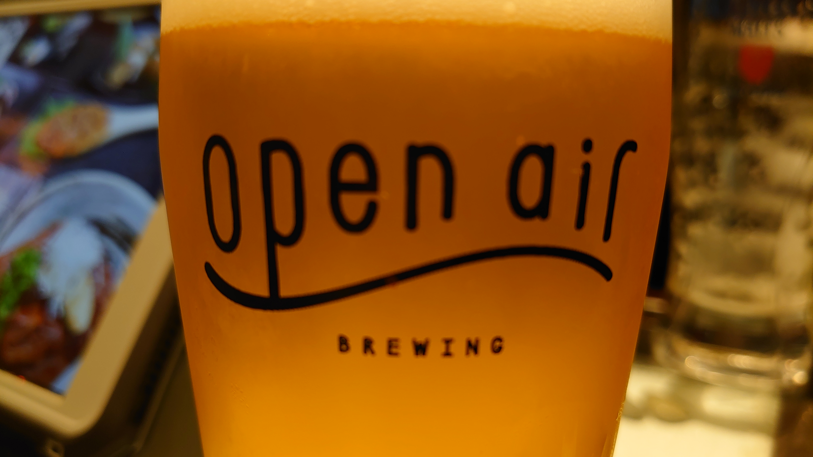

# imagetrack

## 問題文
画像の撮影された郷土料理屋の店名を答えよ。  
Flag形式: `Diver24{店名}`

Please provide the name of the local cuisine restaurant where the image was taken.  
Flag format: `Diver24{restaurant name}`

## 難易度
easy / 100 point (146 solves)

## 解法

クリックで表示

入門用問題として、画像のexif情報から撮影地や店名を求める問題です。  
また得られた情報を多角的に調査・検証させることも目的に含まれています。  

画像に移っている情報から以下の情報が見つかります。
- open airという文字のグラス
  - 神戸で展開されているクラフトビールの会社で、いくつか店舗を持っていることがわかります。
- 背景に注文用のタブレット端末
  - タブレット端末があるため何かしらの店舗で撮影されたことが推測できます。

これらの情報から、株式会社オープンエアが運営している店舗のどこかと推測もできるが、問題文に記載のある郷土料理屋とは反しているように考えられます。

そこで画像に移っている内容以外に、画像のメタ情報を[exiftool](https://exif.tools/)調べると、GPS情報「34º 41' 41.22", 135º 11' 35.58"」が見つかります。
該当の箇所をGoogleMapで調べると近辺に複数のお店を見るけることができます。
座標の位置にある「シャトー北野坂ビル」を選択すると「郷土料理からす」（英語：Karasu）が入居していることがわかり、問題文とも一致することからフラグである可能性が高いことが想定できます。
もしくは、ストリートビューで現地に降り立つのも一つの有効な手段でしょう。

ここでビールという情報のみから座標近辺にある「一番搾りコラボショップ 三宮麦酒 三宮北野坂店」をフラグとするのはミスリードとなっています。
得られた情報を多角的に調査し確実に提供されていることを調査することが望ましいです。

正確にopen airが提供されているかを追調査すると以下の情報が出てくることからも、フラグが「郷土料理からす」で間違いないことが明らかになります。
- [GoogleMapの口コミ内容](https://www.google.co.jp/maps/place/%E9%83%B7%E5%9C%9F%E6%96%99%E7%90%86+%E3%81%8B%E3%82%89%E3%81%99/@34.6949049,135.193134,3a,75y,90t/data=!3m8!1e2!3m6!1sAF1QipOWnUU4pvKmBcK4Vgw2NfpmOqfV1V02mQ4do2CB!2e10!3e12!6shttps:%2F%2Flh5.googleusercontent.com%2Fp%2FAF1QipOWnUU4pvKmBcK4Vgw2NfpmOqfV1V02mQ4do2CB%3Dw203-h304-k-no!7i4000!8i6000!4m9!3m8!1s0x60008ee4f64506f3:0x2ef2ac0195c072d5!8m2!3d34.6947734!4d135.193217!10e5!14m1!1BCgIgAQ!16s%2Fg%2F1tq8jdwq?hl=ja&entry=ttu)
- [Facebookの過去の情報](https://ms-my.facebook.com/world.one.group/photos/a.224107250949947/5925976714096277/?type=3)

**Diver24{郷土料理からす}**（英語表記も可）

