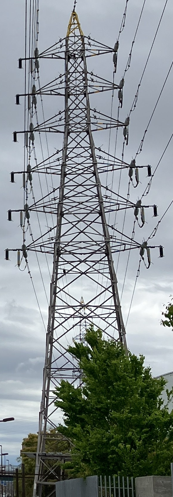
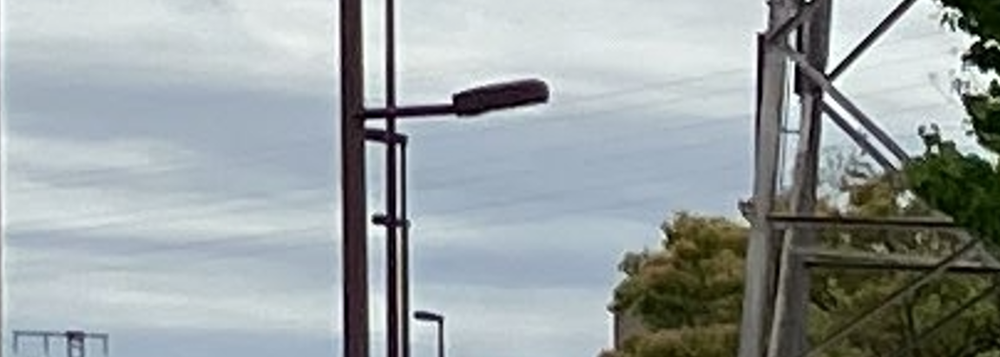
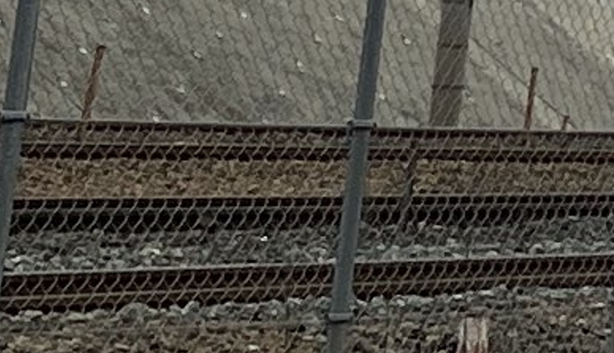
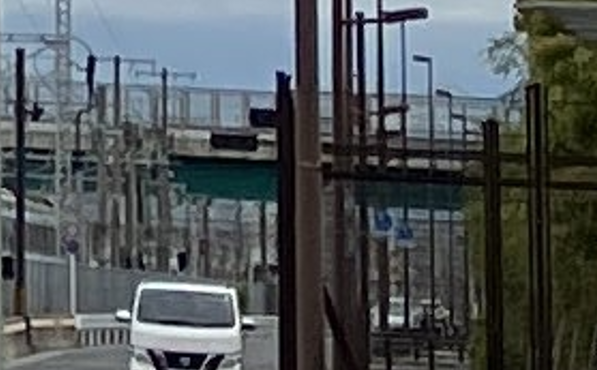
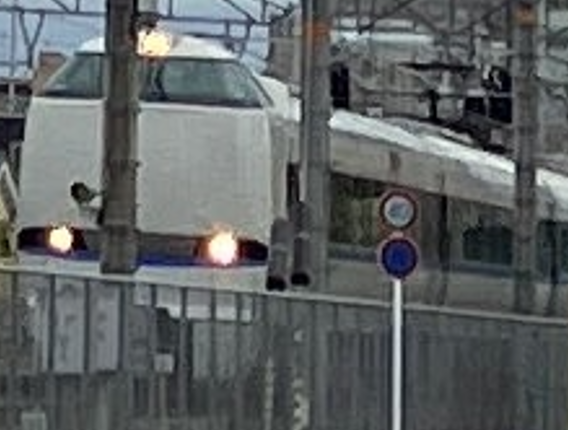

# power

## 問題文

  写真右側に写っている送電線の運用容量値（単位: MW） はいくつだろうか。整数で答えよ。  
  なお、この写真は2024年に撮影されたものである。  
  Flag形式: `Diver24{100}`

What is the operational transmission capacity value (unit: MW) of the transmission line on the right-hand side of the picture? Answer in whole numbers.  
Note that this photo was taken in 2024.  
Flag Format: `Diver24{100}`

## 難易度

medium / 475 point (26 solves)

## 解法

クリックで表示

送電線の運用容量に関連する情報は写り込んでいないため、Geolocationを行った上で送電線の名前を特定し、その情報を精査する必要があります。

### Geolocation

まずは、写真に写っているものから、Geolocationに使用できそうなものを整理していきましょう。

- 鉄塔・送電線
- 線路・橋梁
- 列車

#### 鉄塔・送電線

鉄塔は道路・線路に並行ではなく、少しずつ右側に逸れていることがわかります。

また、線路を跨ぐような送電線も奥に見えます。

#### 線路・橋梁

並行する線路が4本写っています。

線路を橋梁が跨いでいます。

#### 列車

中央奥に列車が映っています。Google Lensに通すと、JR西日本の[683系特急電車](https://ja.wikipedia.org/wiki/JR%E8%A5%BF%E6%97%A5%E6%9C%AC683%E7%B3%BB%E9%9B%BB%E8%BB%8A)であることがわかります。

[英語版Wikipedia](https://en.wikipedia.org/wiki/683_series)には、この形式が使用されている列車名が簡潔に記述されています。

#### 探索

これより、以下の条件で地図を探します。

- 683系（サンダーバード・しらさぎなど）が走行する路線の沿線
- 複々線（線路が4つ並んでいる）
  - 大阪・京都・名古屋などの大都市付近の可能性が高い
- 線路を橋梁が跨ぐ区間
- 鉄塔・送電線が線路と並行しているが、少しずつ線路から離れていく区間。また、線路を跨ぐ送電線もある

線路や橋についてはGoogle Mapsなどから確認できるのですが、送電線は通常の地図サービスで描かれないため、[Open Infrastructure Map](https://openinframap.org/)などを使用するとよいでしょう。また、日本国内に限っては[洋上風力開発エリア ＆ 送電線マップ（β版）](https://www.renewable-ei.org/statistics/offshoremap/?page=jp)も信頼性が高く、有用です。これらのツールは `power line map` や `送電線　マップ`で検索すると得られます。

上記の条件を基に地道に地図を探索すると、JR桂川駅付近の `34.962397, 135.710021` 近辺が画像の撮影場所であるとわかります。

また、地道に探索するだけでなく、OpenStreetMapの地物情報とタグから検索ツールを用いて特定する方法もあるでしょう。

### 運用容量値の調査

[Open Infrastructrue Mapで現場付近を表示する](https://openinframap.org/#16.96/34.962371/135.711283)と、**西院線** という名称がヒットします。

`西院線 運用容量値` で検索すると以下のPDFファイルがヒットし、西院線の欄に **84** と記載されています。
https://www.kansai-td.co.jp/interchange/takusou/pdf/154kv_less_space.pdf

**Diver24{84}**

文字や看板のように検索しやすい情報がない状態であっても、写り込んだ情報を精査していくことでジオロケーションは可能です。また、部分的にその手順を効率化する手法やツールもあります。本問題はその流れを体験することをねらいとしています。

