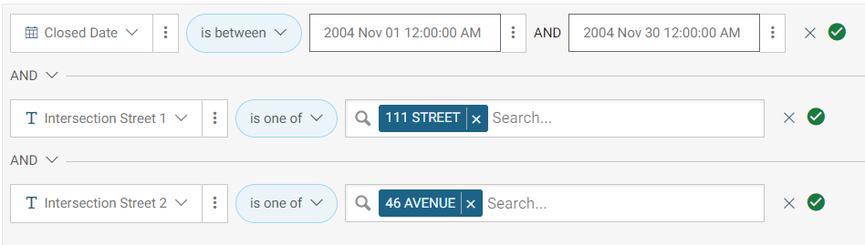
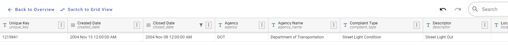

# public_service

## 問題文

ある男が「20年前の11月だったかな、この交差点について市に文句を付けてやったことがあるんだよ。最近の行政は酷いもんだがね、あの頃は良かったよ。」と言っていた。  
彼は何を連絡したのだろうか。資料に記載されている通りの理由を答えよ。  
Flag形式: `Diver24{Something happend}`

One man said, "I once complained to the city about this intersection, 20 years ago, I think it was November. The administration is terrible these days, but those were good days."  
What did he contact them about? Answer why, as stated in the documents.  
Flag Format: `Diver24{Something happend}`

## 難易度

hard / 497 point (10 solves)

## 解法

クリックで表示

まずは撮影場所を特定しましょう。

問題画像の中央部に **Citi Field Parking** という緑色の案内看板があり、右側には特徴的な建築物が見えます。また、道路には **111th St** と通りの名前が書かれており、奥には鉄道らしき高架橋と交差しています。
また、左下のマップからは **45th Ave**という通りが付近にあることも確認できます。

`111th St Citi Field Parking` で[検索](https://duckduckgo.com/?q=111th+St+Citi+Field+Parking&t=h_&ia=web)すると、ニューヨーク市のスタジアムとその近隣の駐車場に関連する情報がヒットします。

この付近から 111th St と鉄道を目印にストリートビューの場所を探すと、111th Street と 46th Avenue の交差点（`40.748145, -73.854048` 付近）であるとわかります。

続いて、行政に連絡が寄せられたことについて考えてみましょう。

ニューヨーク州のものであることから、 `New York City complaint（苦情）` と[検索](https://duckduckgo.com/?q=New+York+City+complain&t=h_&ia=web)すると、[Report Problems · NYC311](https://portal.311.nyc.gov/report-problems/)というページがヒットします。

[説明ページ](https://portal.311.nyc.gov/about-nyc-311/) から概要がわかるほか、 `ニューヨーク 311` で検索すると、[日本語での情報](https://www.ny.us.emb-japan.go.jp/jp/j8/12.html)もヒットします。いずれにせよ、311は行政に対する緊急でないサービス（苦情）を求める際の電話番号であることがわかります。

そこで、問題文中にある情報から `New York 311 2004` と検索すると、ニューヨーク市のオープンデータサイト "NYC OpenData" に格納されている2004年度の記録（[311 Service Requests for 2004](https://data.cityofnewyork.us/Social-Services/311-Service-Requests-for-2004/sqcr-6mww/about_data)）を見つけることができます。

このデータは "Export" のリンクから登録不要でダウンロードできます。また、Webサイト上で情報を絞り込む機能も提供されています。

問題の場所は交差点（intersection）であり、20年前（2004年）とされていることから、以下のクエリで絞り込みを行います。

すると、該当するレコードが1件表示されます。

Descriptorに `Street Light Out` と記載されており、これがFlagです。  
なお、検索機能が柔軟ではないことから、ダウンロードして検索した方がスムーズかもしれません（作問段階ではダウンロードしてgrepしていました）。

**Diver24{Street Light Out}**

この問題では、ジオロケーションを実施した上で、膨大なレコード数のある公開データから必要な情報を絞り込んでもらうということを意図しています。

