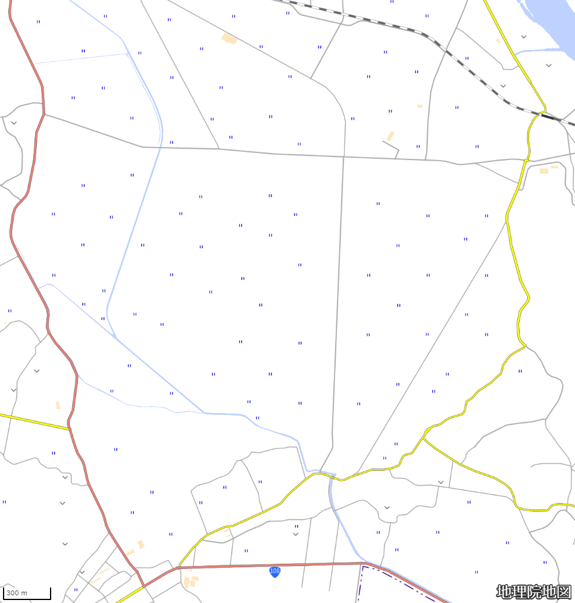

# paddy

## 問題文

この地域では地形の人工的な大規模改変が2回行われたという。郡司としてこれにかかわった人物の名は？  
日本語表記で答えよ。  
Flag形式: `Diver24{人名}`

The area has undergone two large-scale man-made alterations to the terrain. What is the name of the person involved in this as a local governor (郡司)?  
Answer in Japanese (Kanji).  
Flag format: `Diver24{person's name}`

[For non-Japanese speakers]

- Japanese text can be written either vertically or horizontally.
- Historical Japanese is written either horizontally from right to left or vertically. Some old characters (旧字体, Kyūjitai) are also used.

## 難易度

medium / 494 point (14 solves)

## 解法

クリックで表示

まず、この地図の指す場所を特定します。国道108号線の向きと鉄道路線の関係からあたると、[このあたり]( https://www.google.com/maps/@38.4821462,141.2133462,16.01z?entry=ttu )とわかります。

周辺地域での地形改変を調べます。Google検索で「広渕　工事」等と調べると、[「広渕沼の干拓」]( https://www.pref.miyagi.jp/documents/9756/200388.pdf )という資料に行き当たります。
この資料から、

1. 約370年前の広渕沼造成
2. 明治期以降の広渕沼干拓
  
という2つの大規模工事があったことがわかります。

なお、ここで[他記事]( https://kahoku.news/articles/20231025khn000007.html )にもあたってみると、「廣淵」「広淵」の表記もみられます。もともとは「淵」を使っていたと思われることから、検索には廣淵を用いた方がよいでしょう。

ここで、「廣淵沼 干拓」でGoogle検索すると[日本の川と災害]( http://www.kasen.net/ishibumi.htm )というページがヒットします。ここに[廣淵沼開拓記功碑]( http://www.kasen.net/@2/kitakami/kyukita/hirobuch/index.htm )のページがあり、碑文の書き起こしからFlagの人物名がわかります。

**Diver24{山崎與貞}**

また、別資料では、[溜池の分布に就いて]( https://www.jstage.jst.go.jp/article/grj1925/15/5/15_5_319/_pdf )という論文で言及されている[廣淵沼沿革史]( https://books.google.co.jp/books/about/%E5%AE%AE%E5%9F%8E%E7%B8%A3%E5%BB%A3%E6%B7%B5%E6%B2%BC%E6%B2%BF%E9%9D%A9%E5%8F%B2.html?id=kAIIGsZEo8AC )という書籍にもその詳細が記されています。日本語が母語のプレイヤーにはこちらの書籍を読む方が簡単だった可能性もあります。

なお、一般に「[郡司](https://ja.wikipedia.org/wiki/%E9%83%A1%E5%8F%B8)」は律令制時代の役職ですが、[伊達藩（仙台藩）](https://ja.wikipedia.org/wiki/%E4%BB%99%E5%8F%B0%E8%97%A9)では「藩内郡司」という役職が存在したことは検索するとわかります。

