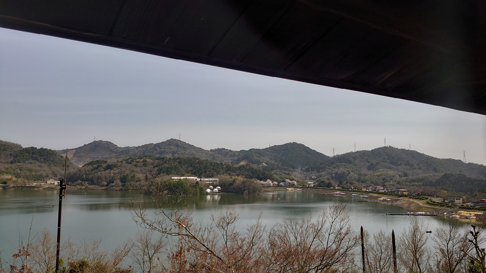

# promoter

## 問題文

画像に写っている池沼を開拓した発起人の父親の命日を答えよ。  
Flag形式: `Diver24{yyyy/MM/dd}`

The pond in the image was cultivated by a certain person who initiated the development in 1628 (Kan'ei 5, 寛永5年). Give the date of death of this person's father.  
Flag Format: `Diver24{yyyy/MM/dd}`

Note: "Kan'ei" (寛永) is one of Japanese era name. ([wikipedia](https://en.wikipedia.org/wiki/Kan%27ei))

## 難易度

easy / 184 point (90 solves)

## 解法

クリックで表示

始めに配布されている画像の池を特定します。画像検索の結果から「入鹿池」ということがわかります。  
より確証をもって特定するのであれば、画像中央に移っている白い半球のテントが実際に存在するかGoogle Mapsなどで確認すると良いでしょう。
さらに多角的に検証するのであれば、画像上部に屋根が一部移っていることや写真の画角を考慮し「幸田露伴住宅 蝸牛庵」の二階から撮影されたことまで特定してみても良いと思います。

いずれにせよ、池の名前が「入鹿池」と分かったので、入鹿池に関して調査し開拓した発起人を見つけ出しましょう。  

入鹿池の概要を掴むためWikipediaで調査を行うと、入鹿六人衆の中の**江崎善左衛門了也**の欄に「発起人」と記載があることがわかります。  
また、父親は江崎善左衛門宗度であることも記載されていますがが命日の記載はありません。

改めて、「江崎善左衛門宗度」について調査を行うと[J-STAGE](https://www.jstage.jst.go.jp/article/jjsidre1965/49/7/49_7_630/_pdf)のドキュメントや[Googleブックス](https://books.google.co.jp/books?id=nWc3pUoc9XsC&pg=PP137&lpg=PP137&dq=善左衛門宗度　11月13日&source=bl&ots=nnspDIhUCC&sig=ACfU3U1cwj0D4k9TQhfvzUOrdSVZsVfMyw&hl=ja&sa=X&ved=2ahUKEwjU0uby0aCFAxVgrVYBHSLvC8oQ6AF6BAgyEAM#v=onepage&q=善左衛門宗度　11月13日&f=false)に、寛永4年11月13日になくなったことが記載されています。

寛永4年11月13日を西暦に変換すると1627年12月20日となり、これがFlagです。

**Diver24{1627/11/13}, Diver24{1627/12/20}**

なお、本問題は終了後にDiscordでご指摘いただいた通り、Flag設定ミスにより、Diver24{1627/11/13}が答えとなっていました。しかしながら、[明治改暦](https://ja.wikipedia.org/wiki/%E6%98%8E%E6%B2%BB%E6%94%B9%E6%9A%A6)前の事象であるため、正しくは **Diver24{1627/12/20}** のみが答えであるべきでした。

開催中に `Diver24{1627/12/20}` は1チームのみから送信されており、そのチームも約3分後に `Diver24{1627/11/13}` を送信していたため、全体への影響は大きくありませんでしたが、混乱を招いてしまったのは事実です。お詫び申し上げます。

