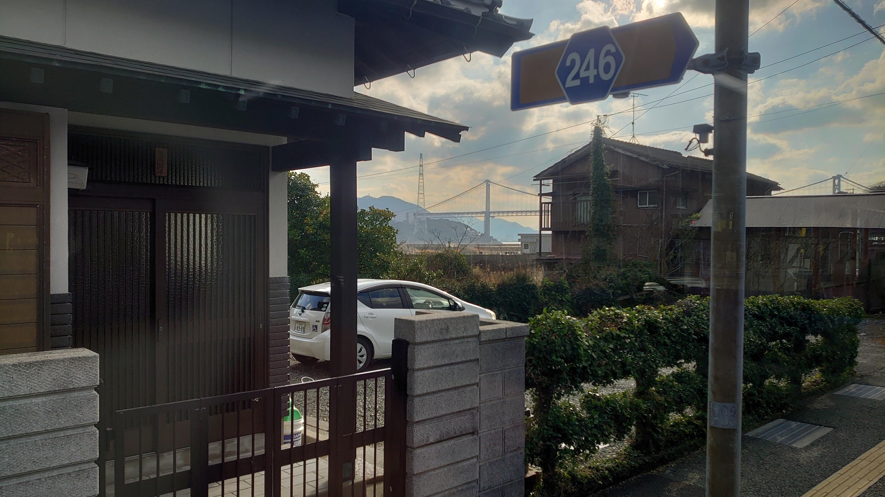

# 246

## 問題文
画像が撮影された場所から最も近い交差点名を答えよ。  
Flag形式: `Diver24{交差点名}`

What is the name of the intersection closest to where the image was taken?  
Flag format: `Diver24{intersection name}`

## 難易度
introduction / 100 point (143 Solves)

## 解法

クリックで表示

入門用問題として、画像の特徴から撮影地を求めるジオロケーションの問題です。

画像の特徴として以下が見つかります。

- 日本の県道246号線
  - これだけだと都道府県はわかりません
- 奥に大きな橋
- 車のナンバーに「下関」の文字
  - 解像度が低いですが、[地名一覧](https://ja.wikipedia.org/wiki/%E6%97%A5%E6%9C%AC%E3%81%AE%E3%83%8A%E3%83%B3%E3%83%90%E3%83%BC%E3%83%97%E3%83%AC%E3%83%BC%E3%83%88%E4%B8%80%E8%A6%A7)から判断することも可能です

橋が見える県道246号線を探すと、下関の関門海峡大橋に絞ることができます。
または、橋の部分のみを切り取って画像検索にかけ特定することもできます（上位候補に明石海峡大橋などと並んで関門海峡大橋が出てきます）。

これより、県道246号線が「山口県道246号」であることがわかります。

Google Mapsで関門海峡大橋が見える位置周辺を探しつつ、山口県道246号の中で海側に位置している箇所を調べると、[写真の撮影場所](https://maps.app.goo.gl/oSCS6AxVhgYgNVNH9)が特定できます。  
この場所に一番近い交差点は「前田」であることがわかります。

**Diver24{前田}**（英語表記も可）

この問題では、ジオロケーションの基本となる以下の手法を確認してほしいというねらいがあります。

- 画像に写っている情報の精査
- Google Lensを用いた対象物の特定

