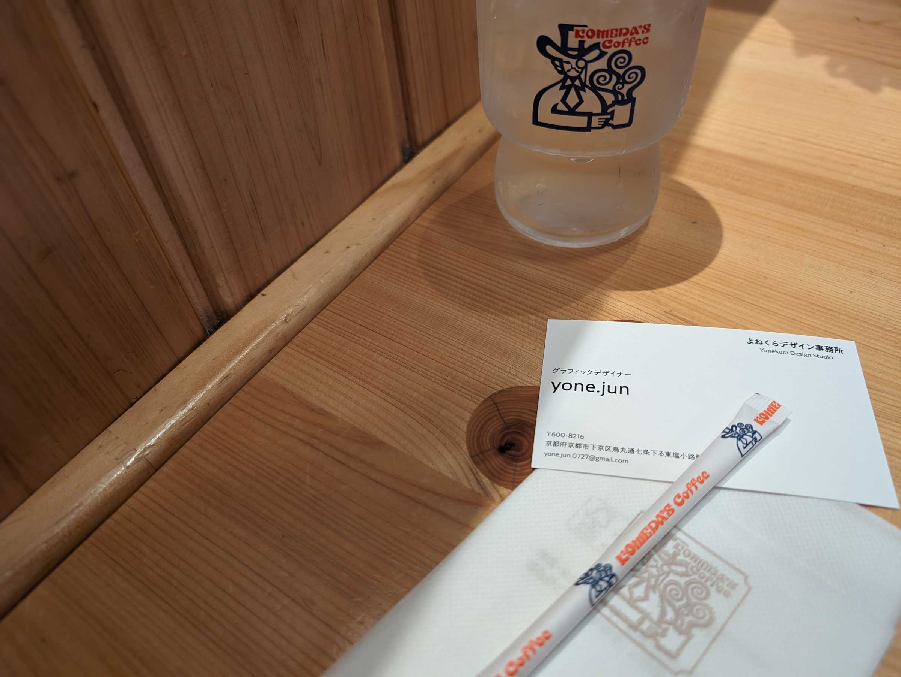

# ad_directiare

## 問題文

この名刺の人物が、東京出張時に食べた昼ご飯の値段を答えよ。  
Flag形式: `Diver24{値段}`  
1000円の場合、Flagは `Diver24{1000}` となります。

Answer the price of the lunch this person on the business card had on a business trip to Tokyo.  
Flag format: `Diver24{price}`  
If it is 1000 JPY, the flag should be `Diver24{1000}`

## 難易度
introduction / 257 point (79 Solves)

## 解法

クリックで表示

配布されている画像に名刺が写っています。

名刺には名前、会社名、住所、メールアドレスが書かれています。
名前や会社名・住所に関しては、検索しても特にそれらしい情報は見つかりません。
そこで、Gmailのアドレスを確認してみましょう。

OSINT分野では、Gmailアドレスに関して[GHunt](https://github.com/mxrch/GHunt)や[Epieos](https://epieos.com/)がよく用いられ、ほかのOSINT CTFでも頻出となっています。これらは `Gmail OSINT` などで検索すると見つけることができます。

これらのツールで与えられたアドレスを検索すると、GoogleカレンダーやGoogle Mapsのレビューが公開されていることがわかります。

Googleカレンダーに記載された情報から、6月3日に飛行機での移動が予定に入っていることがわかります。また、ランチに予約先のお店の電話番号の記載が見つかります。  
Google Mapsにレビューを投稿していることもわかります。口コミを記載しているお店の電話番号がカレンダーに記載されているお店のものと一致することから、東京出張時に食べたと推測できます。  

この口コミの内容に食べたであろうメニューの値段が4,400円と記載されており、これがFlagとなっています。 

**Diver24{4400}**

この問題は、様々なOSINT CTFで頻出となっているGHunt/Epieosを活用する方法を知ってほしいという意図で作成されています。

なお、運営側のミスにより赤出汁を加えた値段を記載できていませんでした。正確にはレビューに記載されている金額ではなく、4895円（`Diver24{4895}`）が厳密な正解となります。本件については開催中に1件問い合わせを受けており、精査の上でFlagの追加を行いました。

ただし、

- 問い合わせを行ったプレイヤーは、4895円をsubmitした後に4400円をsubmitして既に正解していたこと
- 4895円は問い合わせを行ったプレイヤー1名からしかsubmitされていなかったこと
- レビューに名刺の人物から金額が明示されており、それが投稿されると想定していたこと
- introductionカテゴリであることを鑑みて、別解が存在すると告知することで混乱を招きうること
- 本問は解答回数に制限がないこと

以上を考慮し、アナウンスは実施せずにFlagの追加を行いました。最終的に4895円のFlagが他のプレイヤーから送信されることはありませんでした。

