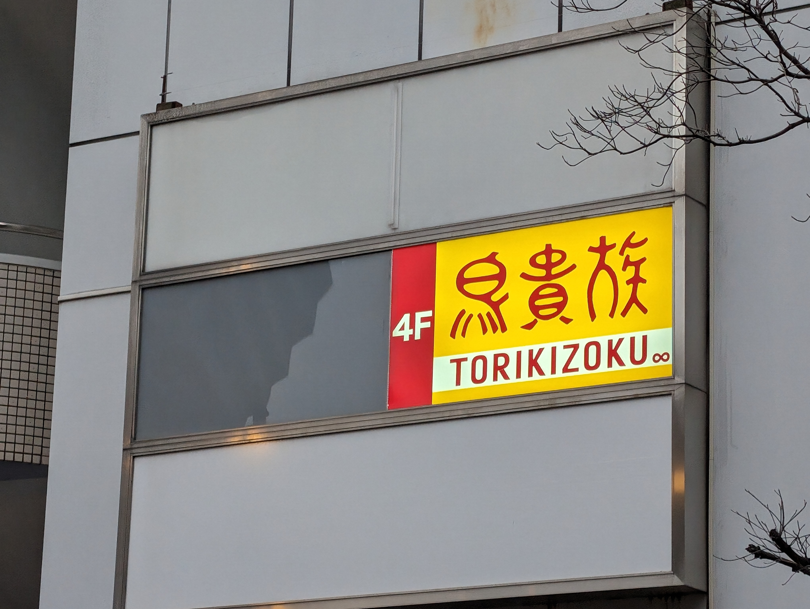
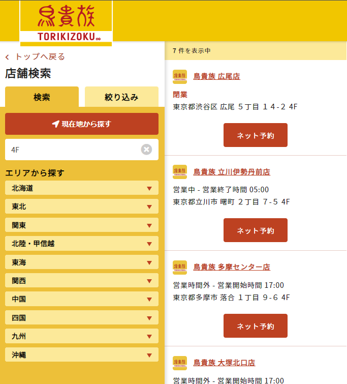

# chain

## 問題文
この看板の店の電話番号を答えよ。  
Flag形式: `Diver24{0123456789}`  
注意: 電話を掛けてはならない。Web上の情報から調査せよ。

Answer the phone number of this restaurant.  
Flag format: `Diver24{0123456789}`
Note: DO NOT MAKE ACTUAL PHONE CALL. Search on the web.

## 難易度
introduction / 100 point (110 solves)

## 解法

クリックで表示

チェーン店「鳥貴族」の店舗を特定する問題です。画像からは4Fに店舗が存在することが分かります。

シンプルに `鳥貴族` あるいは `TORIKIZOKU` で検索して公式サイトを開きます。[店舗検索ページ](https://map.torikizoku.co.jp/store)が用意されており、キーワードに "4F" を入力すると、7店舗がヒットします（CTF開催時点）。

7軒であれば、全部確認しても時間はかかりません。ストリートビューから「[鳥貴族 広尾店](https://map.torikizoku.co.jp/store/373)」の看板と一致することがわかり、この店舗の電話番号がFlagとなります。

この問題では、ジオロケーションに際して写り込んだチェーン店を利用してほしいという意図があります。
チェーン店は膨大な店舗数があることも多いですが、公式サイトで検索機能が用意されていることも多く、これを活用することで場所の絞り込みに繋がるケースがあります。

なお、解答には使えないと判断してメタデータを残していました。しかし、「周囲の看板がないことから閉店しているのでは」と推測した上で、撮影日とSNSの情報を組み合わせてFlagに辿り着いたというチームもありました。お見事です。

