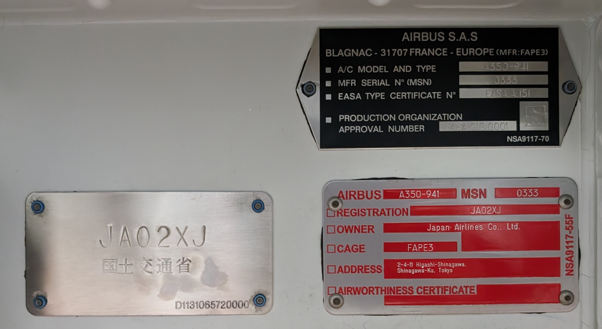

# serial

## 問題文

これらの動画の背景に映っている航空機のシリアル番号は何か？ シリアル番号が123456の場合、Flagは `Diver24{123456}` となる。  
What is the serial number of the aircraft in the background of these videos? If the serial number is 123456, the flag will be `Diver24{123456}`.  

- [https://www.tiktok.com/@ana_allnipponairways/video/7318648417620741377](https://www.tiktok.com/@ana_allnipponairways/video/7318648417620741377)
- [https://www.tiktok.com/@ana_allnipponairways/video/7338422699301145857](https://www.tiktok.com/@ana_allnipponairways/video/7338422699301145857)

## 難易度

introduction / 100 point (223 solves)

## 解法

クリックで表示

機体後方に"JA222A"、前部に "222" と書かれているANAの航空機が確認できます。
もし読みづらくても、`ANA 222` や `ANA JA222` のように断片をGoogle検索すると、JA222Aに辿り着くことができます。

JA222Aはこの航空機の機体記号（Registration）であり、シリアル番号ではありません。

そこで、`JA222A` でGoogle検索すると[Planespotters](https://www.planespotters.net/airframe/airbus-a320neo-ja222a-all-nippon-airways/3v6npy)や[Flyteam](https://flyteam.jp/registration/JA222A)、[JA-Fleet](https://ja-fleet.noobow.me/AD/JA222A)などの航空機情報サイトがヒットし、シリアル番号（MSN）が判明します。

**Diver24{9580}**

この問題では、シンプルに検索するだけでも様々な情報が得られるというOSINTの基本を知ってもらうという意図があります。

また、今回の航空機のシリアル番号（製造番号、MSN）自体も有益な情報です。機体の番号は売却されると変わりますが、シリアル番号は不変です。以下の記事で示すように、売買や移籍の動向を追跡する際などに利用できます。

- [経済制裁下でロシアに渡ったビジネスジェット（2023年） （ryo-a）](https://note.com/vitya/n/n6f6734d59d20)

なお、旅客機はドアの上部にシリアル番号が刻印されています（以下の画像であれば"MSN"の欄）。次回、飛行機に乗ることがあればチェックしてみてください。

余談ですが、「元ソースはどのようにシリアル番号を手に入れているのか」という疑問もあるでしょう。大きく分けて2つの経路があります。

1つは公的な情報です。航空機は各国の行政機関（日本であれば国土交通省航空局）に登録されており、登録原簿が存在します。日本であれば郵便による開示請求が必要ですが、アメリカなど一部の国はWebから参照できます。

もう1つは目撃情報（航空ファンによる現地調査）です。航空機は製造時に、シリアル番号が機体に大きく描かれます（[エアバス工場の例](https://www.planespotters.net/photo/1603075/f-wwtm-air-astana-airbus-a320-271n)、[ボーイング工場の例](https://www.planespotters.net/photo/1524300/n4022s-united-airlines-boeing-737-8-max)）。特に製造工場は航空ファンにとって重点的なウォッチ対象となっており、製造中の航空機の動向は頻繁に報告されます。

