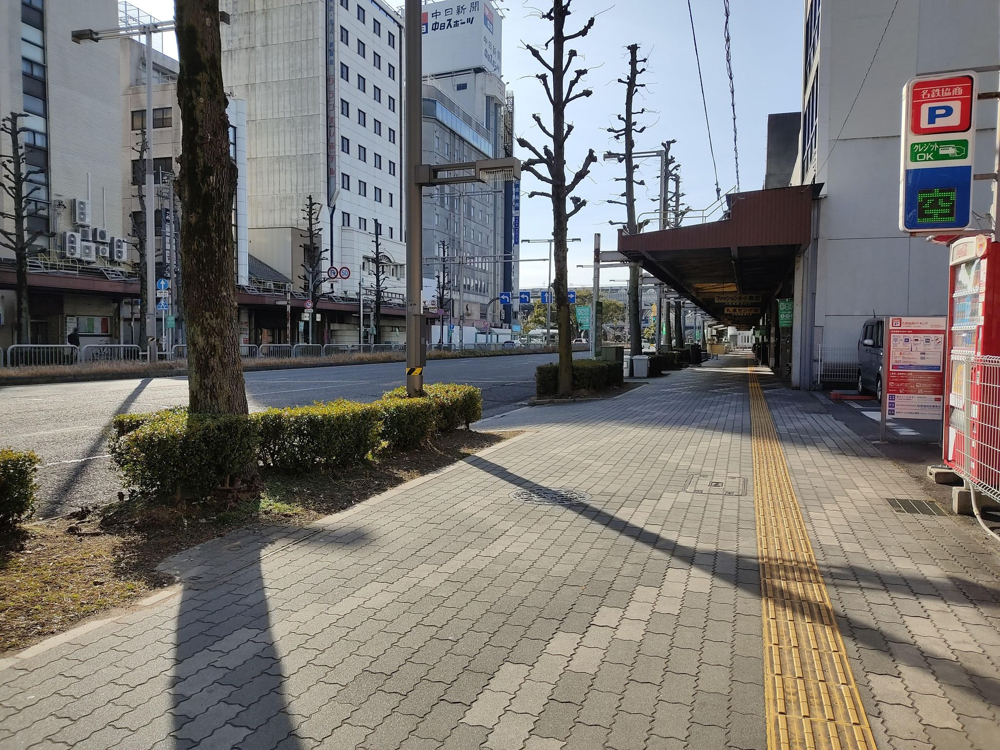

# mapper

## 問題文

あなた方は極めて高い調査スキルを持っていると聞いた。我々の身分は明かせなくて申し訳ないのだが、一つ調査依頼を受けてくれないだろうか。  
我々はある男を追っている。  
情報が見つからず困っていたのだが、彼が撮ってアップロードした写真を見つけた。現地時間でいつ撮影されたのか特定してほしい。

Flag形式: `Diver24{yyyy-MM-dd HH:mm}`  
例えば、2024年6月5日午後3時14分ならば `Diver24{2024-06-05 15:14}`となります。

この問題に正解すると、2問が新たに追加されます。

You have extremely high investigation skills. We are sorry that we cannot reveal our identities, but we would like to ask you for an investigation.  
We are in pursuit of a man.  
We were having trouble finding information, but we found a photograph he took and uploaded. We need you to identify when it was taken in local time.

Flag format: `Diver24{yyyy-MM-dd HH:mm}`  
For example, if it is 3:14 pm on 5 June 2024, the flag should be `Diver24{2024-06-05 15:14}`.

If you answer this challenge correctly, two new challenges will be added.

## 難易度

easy / 500 point (2 solves)

## 解法

クリックで表示

この画像のExifには特に撮影時刻を示すデータはありません。また、日時・時刻を推定できる要素は画像内に写っていません。
さらに、この画像そのものをReverse Image Searchしても同一の画像は見つかりません。

そこでまず、この場所を特定します。画像の左側のビル群をGoogle Lensにかけると、岐阜県のJR岐阜駅前であることわかります。
とりあえずはGoogleのストリートビューでこのあたりでユーザーにより投稿された画像を探します。しかし、該当するものは見つかりません。

そこで、さらに別の手段を考えます。「彼が撮ってアップロードした写真」とあるので、ネット上のどこかにあるのではないか、と考えます。しかし、ネット上の情報を無為に探るのは難しく、何かしらの手がかりが必要です。

場所がわかる写真を得たら、まずは撮影地やその近辺について調べてみるのは一つの手です。

岐阜駅前であると分かったので、[Wikipediaの岐阜駅の記事](https://ja.wikipedia.org/wiki/%E5%B2%90%E9%98%9C%E9%A7%85)（[英語版](https://en.wikipedia.org/wiki/Gifu_Station)も可）を参照し、右上にある「座標」のリンクをクリックすると[Geohack](https://geohack.toolforge.org/geohack.php?language=ja&pagename=%E5%B2%90%E9%98%9C%E9%A7%85&params=35_24_34.250_N_136_45_23.475_E_region:JP_type:railwaystation)というサービスにリンクされます。
Geohackは非常に有用なリンク集で、座標情報を基に外部の地図サービス・GISサービスへ転送してくれるものです。グローバルなものだけでなく、その地域単位のサービスも一部カバーしており、よく知らない地域の情報収集に用いることができます。

Geohackには `Mapillary.com Crowdsourced street view` というリンクがあり、"crowdsourced"と書かれていることから利用者が投稿できる性質であると判断できます。

また、メタ的な解き方にはなってしまうのですが、問題文のタイトル"mapper"も一種のヒントです。Discord上のAnnouncementでも、「チャレンジ全体を注意深くよく読んで」とアナウンスしています。
"mapper image/photo upload"や "mapping image upload"といった検索が有効です。OSINT CTFでは「問題文に登場した情報をそのまま検索する」という手法が用いられることがあります。（[mapper](https://eow.alc.co.jp/search?q=mapper)という単語から OSINT CTFでよく使われるOpenStreetMapを想起し、"[OSM streetview](https://duckduckgo.com/?t=h_&q=osm+streetview&ia=web)"で検索することでMapillaryの存在を認識できます。）

あるいは、場所を特定する（ジオロケーション）の段階で "OSINT geolocation" と検索し、Google MapsやOSMなどと並んで有用なツールとして挙がっているのを見た人もいるかもしれません。

なお、このチャレンジの画像には、メタデータ（IPTC）に["FBMD"から始まる文字列](https://iptc.org/news/what-does-facebook-do-with-your-photo-metadata/)が含まれています。これはMapillaryがMeta社の傘下にあることによるものです。Meta社のサービスはFacebookやInstagramが有名ですが、Wikipediaを確認すると[日本語版](https://ja.wikipedia.org/wiki/Meta_(%E4%BC%81%E6%A5%AD))・[英語版](https://en.wikipedia.org/wiki/Meta_Platforms)ともにMapillaryを買収したことが概要のセクションに記載されており、ここに着目してMapillaryを知ることも可能です。

いずれにせよ、Mapillaryというサービスでこの場所のあたりの投稿を探すと、[この投稿]( https://www.mapillary.com/app/?pKey=438678415240541 )にヒットします。  
Image Detailsに、撮影日2023年2月6日、撮影時刻9時46分が入っているのでこれがフラグとなります。

なお、作問・レビュー過程において easy で分類していた理由ですが、以下の通りです。

- Mapillary自体はストリートビューが存在しない地域でのジオロケーションに用いられるため、ジオロケーション上級者なら知っている人も居ると考えられた
- ツールを知らなくても、Wikipediaという基本的な情報源から1クリックで見つけられる
- 加えて、タイトルをヒントとしたメタ的な解き方も可能であり、その到達過程も複数考えられる

しかし、結果的にsolves数が少なかったことを考えると、難易度の設定が easy であるべきではなかったと認識しています。

このような問題に関しては、今後の難易度調整で改善を図ってまいります。

