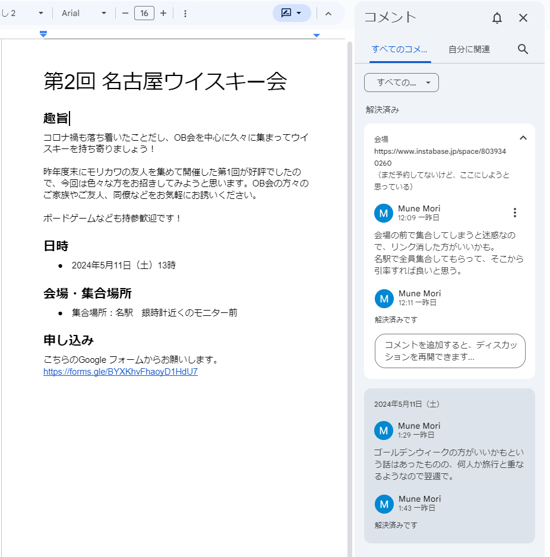

# venue

## 問題文

我々が追っている人物は2024年5月にイベントを開催していたらしいことが判明した。我々は予約履歴を照会したいと考えている。  
そのために会場と思われる場所を特定してもらえないだろうか。  
Flag形式: `Diver24{会場のURL}`

It turns out that the person we are tracking seems to have organised an event in May 2024. We are thinking of querying their booking history.  
Could you identify the venue for this event?  
Flag format: `Diver24{URL of the venue}`

## 難易度

easy / 500 point (2 solves)

## 解法

クリックで表示

Mapillaryと同じユーザIDを使用しているX (Twitter) には、Googleドキュメントへのリンクがあります。

https://twitter.com/mori_mune24/status/1783088459449811422

Google ドキュメントには集合場所のみが記載されており、会場は不明です。
しかし、コメントを表示すると、削除された文字列部分に会場候補のURLが記載されています。

このURLを開くと、名古屋にあるイベントスペースのものであると分かります。

**Diver24{https://www.instabase.jp/space/8039340260}**

文書作成ツールには、編集履歴が残っていることがあり、時にはそこに削除された情報が残っている可能性を知ってほしいという意図で作問されました。

