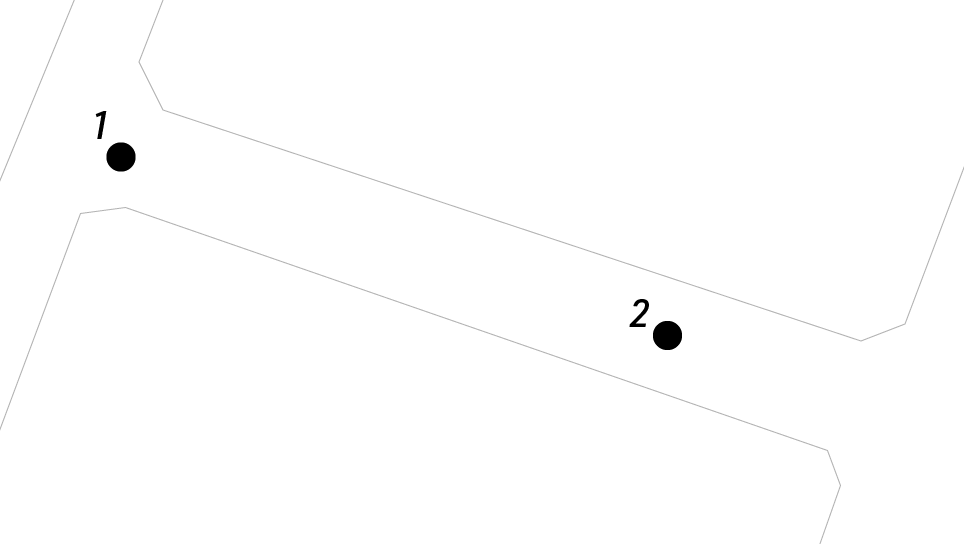

# howmany

## 問題文

画像の通り、2つのマンホールがある。2024/05/30 23:46 (JST) 時点で、この2つのマンホールの間で何台の赤い自転車を**返却**できたと考えられるだろうか。また、返却地点のIDは何だろうか。  
Flag形式: `Diver24{台数_ID}`  
例えば、赤い自転車を10台返却でき、その場所のIDがa10012bであった場合、Flagは`Diver24{10_a10012b}`となる。

As shown in the image, there are two manholes - how many red bicycles could have been **returned** between these two manholes at 23:46 (JST) on 2024/05/30? Also, what is the identifier of this returning point?  
Flag format: `Diver24{number of bicyecle can be returned_ID}`  
For example, if 10 red bicycles could be returned and the ID of that place is a10012b, the Flag shoule be `Diver24{10_a10012b}`.

**howmany1.jpg**  


**howmany2.jpg**  


**location.png**  


### Hint

- location.pngは、上の方が北です。location.png is a north-up map.

## 難易度

hard / 497 point (10 solves)

## 解法

<details>

<summary>クリックで表示</summary>

文字が読み取れるマンホール（howmany1）、文字が読み取れないマンホール（howmany2）、2枚のマンホールの位置関係を示したと思われる地図（location）が示されます。

文字が読み取れるマンホールでは `東京　下水道　62 0I 3F 08` などと記載されているほか、Reverse Image Searchから東京のマンホールであると分かります。「東京 マンホール 番号」で検索すると [東京番ホールマップ - 駅からマンホール](https://ekikaramanhole.whitebeach.org/ext/0A0A/) というWebサイトがヒットします。

入力欄に従い、 `62 0I 3F` と入力すると、人孔番号 `201412062` および新宿駅付近の地図、そして「下水道台帳 2014ページ の 1B に記載されています」と表示されます。
なお、`0I` が `01` と紛らわしいのですが、 `01` ではエラーが表示されるほか、「お勧めの番ホールマップ」部分から「数字+アルファベット」の並びになっているものがあることから、 `0I` であると判断できます。

「下水道台帳」を検索すると、東京都の[下水道台帳案内](https://www.gesui.metro.tokyo.lg.jp/contractor/d1/daicyo/)がヒットします。先ほどのマップで表示された新宿付近を「索引図」などから辿ると、新宿区役所付近に似たような配置の場所が見つかります。「施設の詳細確認」をクリックすると、人孔番号 `201412062` も一致していることが確認できます。

このエリアを Google Mapsで確認すると「ドコモ・バイクシェア」が存在していることが判明します。[ドコモ・バイクシェア](https://docomo-cycle.jp/)のバイクは赤色であり、問題文で示唆されるものがこれであると分かります。

ドコモ・バイクシェアのサイトを表示し、[東京広域エリアのポート一覧マップが掲載されているページ](https://docomo-cycle.jp/tokyo/)から、当該のポートが `D6-01.新宿区役所本庁舎 / Shinjuku City Office Main Bldg.` という名前であることが判明します。また、Googleストリートビューでは古い画像しか得られませんが、同サイトの写真から道路沿いに木製の柵で囲まれたバイクシェアのポートの画像も確認でき、これは問題で与えられた画像に写り込んだ柵の様子と一致します。

ただし、ドコモ・バイクシェアのアプリやGoogle Mapsの表示からは現在状況しか表示されません。このような場合、何らかのAPIが公開されていないか探してみるのも手の一つです。

そこで、`docomo bikeshare api` で検索すると、[GBFS](https://gbfs.org/)形式のAPIが[公共交通オープンデータ協議会（ODPT）](https://ckan.odpt.org/en/dataset/c_bikeshare_gbfs-d-bikeshare/resource/e27ef00c-6395-4b3f-8acf-28ee8ebf7d6d)から提供されていることが分かります。

[`station_information`](https://api-public.odpt.org/api/v4/gbfs/docomo-cycle-tokyo/station_information.json) を `新宿区役所`で検索すると、

```json
{"lat":35.693602,"lon":139.703229,"name":"D6-01.新宿区役所本庁舎","capacity":48,"region_id":"5","station_id":"00010184"}
```

というフィールドが見つかります。この `station_id` (00010184) を用いて [`station_status`](https://api-public.odpt.org/api/v4/gbfs/docomo-cycle-tokyo/station_status.json) を検索すると、以下のようなフィールドが見つかります。

```json
{"is_renting":true,"station_id":"00010184","is_installed":true,"is_returning":true,"last_reported":1711217944,"num_bikes_available":0,"num_docks_available":48},
```

ただし、これはあくまで現在時点での状況であり、過去の状況は取得できません。
そこで、このAPIの仕様を確認してみると、特に認証は行われず固定のURLでJSONファイルが配信されているものであると分かります。つまり、同一のURLでキャッシュが残っている可能性があるということです。

Archive.todayを確認すると、[当該時刻](https://archive.md/https://api-public.odpt.org/api/v4/gbfs/docomo-cycle-tokyo/station_status.json)にアーカイブが残っています。

```json
{"is_renting":true,"station_id":"00010184","is_installed":true,"is_returning":true,"last_reported":1717080364,"num_bikes_available":4,"num_docks_available":41}
```

問題に示された時刻において、`num_bikes_available` が4であるため、このステーションに利用可能な自転車が4台あったと分かります。併せて、`num_docks_available` が41であり、41台駐輪可能であったと分かります。

ちなみに、
```
貸し出し可能台数（num_bikes_available） = 総ドック数 - 駐輪可能台数（num_docks_available） - 故障やバッテリ切れで貸し出しできない台数
```
となっています。

なお、新宿区役所西側の `35.6938388, 139.7031075` 付近に存在していた駐輪スポットは南側に統合されており、CTF出題時点で問題として成立する（つまり、西側のスポットによって台数に齟齬が発生しない）ことを確認しています。この情報は[オンラインでも確認](https://shinjukunews.com/42376)できますが、運営チームが実地でも確認を行いました。

**Diver24{41_00010184}**

この問題の前半は、以下の記事に着想を得ています。

- [【個人情報が盗まれる】SNSの写真で気を付けるべきポイント（TBS）](https://topics.tbs.co.jp/article/detail/?id=7248)

「マンホールから撮影場所がわかる」という話は時折SNSで見かけますが、どのような原理で可能なのかを知っていただき、個人情報の保護に繋げていただきたいという意図があります。

後半部分は公開されているAPIの活用を念頭に置いたものです。
各分野において公共データのオープンデータ化が進んでおり、これらは調査において強力なデータソースとなります。

</details>
