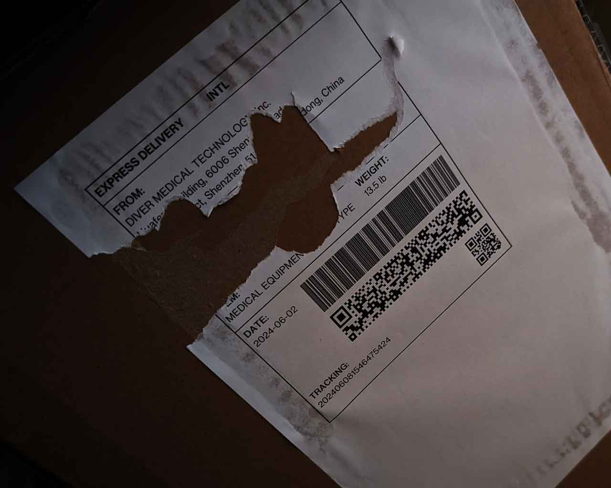

# label

## 問題文

この荷物の宛先として考えられる施設の郵便番号を教えてほしい。  
例えば在日アメリカ大使館が答えの場合、Flagは `Diver24{107-8420}` となる。

Please tell me the postal code of the facility as a likely destination for this package.  
If it is the US embassy in Japan, the flag will be `Diver24{107-8420}`.



## 難易度

medium / 352 point (62 solves)

## 解法

<details>

<summary>クリックで表示</summary>

荷物ラベルが破られていて、宛先部分を読み取ることができません。バーコードらしきものが3種類あります。

バーコードとQRコードからは数字しか読み取れません。残り1つは見慣れないコードですが、QRコードの派生形を調べると[rMQRコード](https://www.denso-wave.com/ja/adcd/fundamental/2dcode/qrc/rmqr.html) であると分かります。

いくつかQRコードリーダーのアプリケーションを探すと、「クルクル - QRコードリーダー」 ([App Store](https://apps.apple.com/jp/app/%E3%82%AF%E3%83%AB%E3%82%AF%E3%83%AB-qr%E3%82%B3%E3%83%BC%E3%83%89%E3%83%AA%E3%83%BC%E3%83%80%E3%83%BC/id911719423) / [Play Store](https://play.google.com/store/apps/details?id=com.arara.q&hl=ja&gl=US&pli=1))などでrMQRコードの読み取りが可能であるとわかります。

これを読み取ると

```
Baba-cho 14-1, Tsuruoka City, Yamagata
```

という住所が得られます。これをGoogle検索すると「慶應義塾大学鶴岡タウンキャンパス」が立地しているとわかります。Webサイトに[郵便番号](https://www.ttck.keio.ac.jp/en/contact/index.html)が記載されており、これがFlagです。

**Diver24{997-0035}**

この問題には、バーコードやQRコードは一般的な形式以外のものが存在すること、そしてそれらにも（当然ながら）読み込む手段が存在することを知ってほしいという意図があります。また、これらも `横長 QRコード` といった単純な検索ワードで辿り着くことができます。

今回はさまざまな制約から架空のラベルを問題にしましたが、実世界のコードも、読み込んでみると思いがけない情報が得られることがあります。

</details>