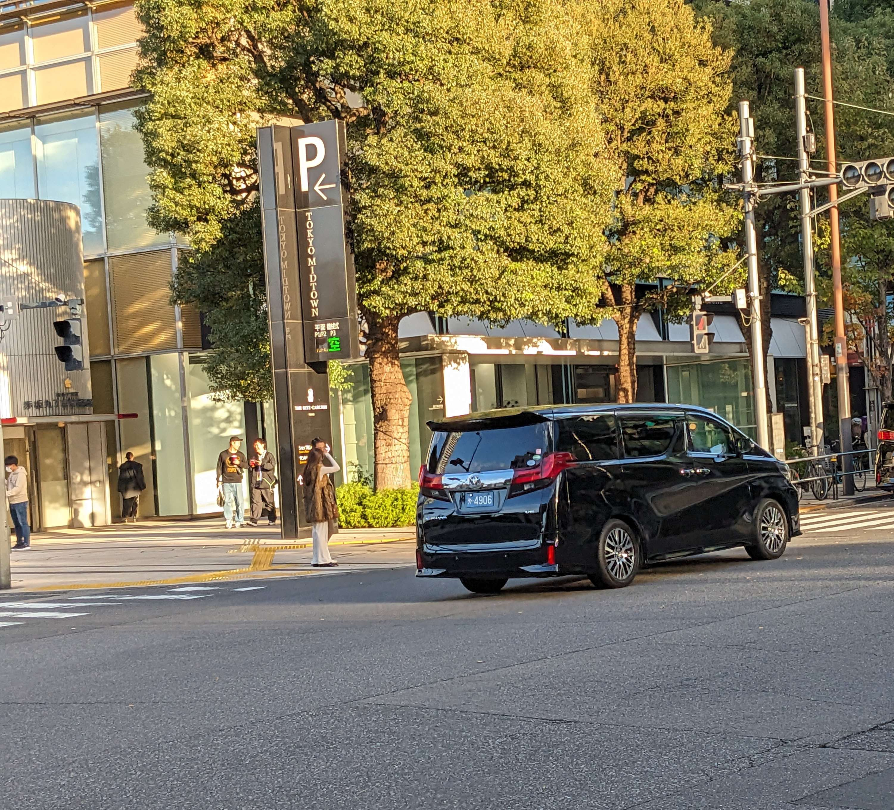

# number

## 問題文

この車両の持ち主に連絡を取りたい。電話番号を調べてもらえないだろうか。  
Flag形式: `Diver24{0123456789}`

注意: 実際に電話を掛けてはならない。

I would like to contact the administrator of this vehicle. Could you please find out their telephone number?  
Flag Format: `Diver24{0123456789}`

CAUTION: DO NOT MAKE AN ACTUAL PHONECALL

## 難易度

easy / 100point (176 solves)

## 解法

クリックで表示

背景に映り込んだ "TOKYO MIDTOWN" から、撮影地が東京であるとわかります。

拡大してみると `外-4906` と記載されています。Wikipediaで[日本のナンバープレート](https://ja.wikipedia.org/wiki/%E6%97%A5%E6%9C%AC%E3%81%AE%E3%83%8A%E3%83%B3%E3%83%90%E3%83%BC%E3%83%97%E3%83%AC%E3%83%BC%E3%83%88)について調べると、青地に外のナンバーは「外交官車両」に付与されることがわかります（また、この情報は[英語版Wikipedia](https://en.wikipedia.org/wiki/Vehicle_registration_plates_of_Japan)にも記載されています）。

Wikipediaによると、`49` から始まる車両はクウェートの車両であると記載されています。ソースの確証が持てないため、外交官車両について検索すると、[49から始まる車両がクウェート国旗を掲げている画像](https://minkara.carview.co.jp/userid/589818/album/1413119/)が投稿されていることなどから、この情報が概ね確かなものであると判断できます。

これより、[在日クウェート大使館](https://www.kuwait-embassy.or.jp/)の電話番号がFlagとなります。

なお、日本における外交官ナンバーは外務省の管轄下にあります。本問の作成に先立ち、正確な情報を得るべく、運営メンバーの1人が日本国外務省に対して[開示請求](https://www.mofa.go.jp/mofaj/public/johokokai/gaiyou/index.html)を実施しましたが、不開示となっています。

