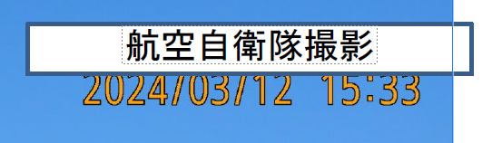

# timestamp

## 問題文

"53" と塗装されている航空機の写真が撮影された日時を答えよ。
https://twitter.com/jointstaffpa/status/1767515646286549226  
Flag形式は `Diver24{YYYY-MM-DDThh:mm}` 
例えば2024年4月1日13時45分に撮影された場合、`Diver24{2024-04-01T13:45}` となる。

Answer the date and time the photograph of the aircraft painted “53” was taken.
https://twitter.com/jointstaffpa/status/1767515646286549226  
Flag format: `Diver24{YYYY-MM-DDThh:mm}`
For example, if the photo was taken at 13:45 on 1 April 2024, the flag should be `Diver24{2024-04-01T13:45}`.

## 難易度

easy / 404 point (50 solves)

## 解法

クリックで表示

リンク先から、防衛省統合幕僚監部のアカウントから行われたSNSの投稿が確認できます。

防衛省統合幕僚監部のWebサイトにアクセスし、[日本語版でのプレスリリースのページ](https://www.mod.go.jp/js/press/)を開くと、3月12日の欄からX（Twitter）の投稿で示された情報と同じ内容が掲載されているPDFが閲覧できます。

https://www.mod.go.jp/js/pdf/2024/p20240312_01.pdf

このPDFをダウンロードし、任意のPDF編集ソフトで画像を移動させたり、画像を書き出したりすると「航空自衛隊撮影」という文字で隠されていた部分の下にタイムスタンプ`2024/03/12 15:33` が残されていることが確認できます。

**Diver24{2024-03-12T15:33}**

この問題は、PDF上で黒塗りにされた情報が、簡単な編集操作によって見えてしまう情報流出事故（複数事例あり）に着想を得たものです。

- [黒塗りの情報公開「こうやると見える」　市民から指摘、個人情報も（朝日新聞）](https://digital.asahi.com/articles/ASQ8L756CQ8LOBJB001.html)
- [大分大で個人情報漏えいの可能性　PDF黒塗り失敗　編集で閲覧できる状態に（ITmedia）](https://www.itmedia.co.jp/news/articles/2302/28/news189.html)
- [謝罪…“いじめ報告書PDF”の黒塗りマスキング外れてしまう…ある操作で　ネットに公開、繰り返されたミス（埼玉新聞）](https://www.saitama-np.co.jp/articles/39152/postDetail)

また、同一画像の別ソースを辿ってほしいという意図もあります。  
SNS上で公開された画像はメタデータが消えたり、解像度が低くなっていたり、分析には不十分であることも多いのですが、別ソースを辿ることでよりよい元データが見つかることもあります。

