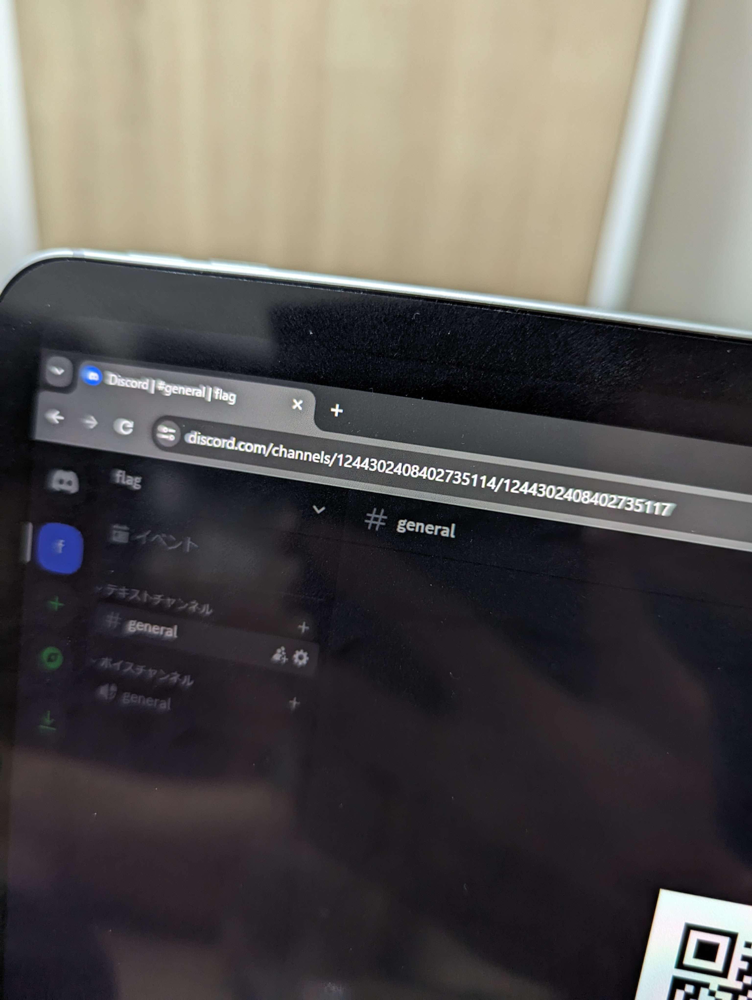

# wumpus

## 問題文

とあるDiscordサーバにFlagが投稿されたぞ！  
本問に限って、ターゲットに接触を試みても大丈夫だ。

Flag has been posted on a Discord server!  
Only for this challenge, it is okay to attempt to contact the target.

## 難易度
medium / 356 point (61 solves)

## 解法

クリックで表示

Discordが示されていることから、まずはサーバーへ入る方法を考えます。

Discordはコミュニティの場としてよく用いられていることから、サードパーティが作成したDiscordサーバーリストが多く存在しています。  

その中には、URLが `<Host>/<ServerID>` で構成されるサイトもあり、そのようなサイトを探して、`<ServerID>` を入力すると以下のサイトがヒットします。  
  
https://discordservers.com/server/1244302408402735114  
  
Joinをクリックするとサーバーに参加することができ、QRコードからFlagが獲得できます。

**Diver24{Discord_1s_m0s7_u5efu1_t001}**

