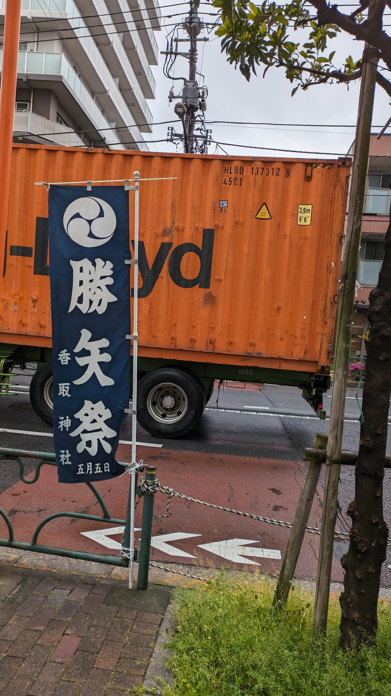
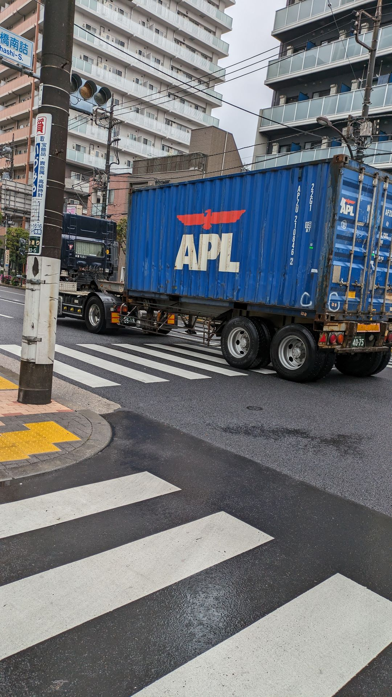

# container

## 問題文

これらの画像の撮影日と時間帯（午前か午後か）を答えてください。  
フラグ形式は`Diver24{YYYY-MM-DD-[AP]M}`です。たとえば、2024年6月9日午前ならば、`Diver24{2024-06-09-AM}`となります。

Specify the date and time (morning or afternoon) when these images wwre taken.   
Flag format: `Diver24{YYYY-MM-DD-[AP]M}`  
Flag Example: Morning of June 9, 2024 -> `Diver24{2024-06-09-AM}`

**png.jpg**  

**png2.jpg**  

## 難易度

medium / 496 point (12 solves)

## 解法

クリックで表示

与えられた2枚の画像から、撮影地が東京都内であることがわかります（Google Lensによる「[勝矢祭](https://www.gotokyo.org/jp/spot/ev019/index.html)」の検索や、ガードレールの形状など）。

そこでまず、コンテナを検索し東京に到着した日を探します。どんな方法でも良いのですが、[track-traceのcontainer tracking](https://www.track-trace.com/container)のページにたどり着けます。ここで、HLBUから始まるコンテナを調べると、5/22～5/24に清水港を出入りしていることがわかります。もう一方のAPZUから始まるコンテナを調べると、東京の街中にに4/19 15:35から4/22 13:18の間にいたことがわかります。1枚目の画像において、「五月五日」の祭ののぼりがあることから、5/5よりは前であると考えられます。よって、4/19～4/22の間が日程候補と絞り込めます。

ここで日付の候補が複数あるので困りますが、画像内の路面の状況から降雨を察することができます。よって、2024年4月19日から22日の天気を調べます。

気象庁HPの「[過去の気象データ検索](https://www.data.jma.go.jp/stats/etrn/index.php)」から、勝矢祭が開催される香取神社に近い観測点（アメダス観測点の東京あるいは江戸川臨海）を探します。このページでは、1日毎の降雨状況がわかります（<https://www.data.jma.go.jp/stats/etrn/view/daily_a1.php?prec_no=44&block_no=0370&year=2024&month=4&day=21&view=>）。

これによると、21日、22日に降雨があったことが確認できます。しかし、日をクリックして1時間毎の観測データをみると、21日は夜の降雨であり、画像が昼の様子であることを考えると条件に合致しません。22日は朝から降雨があったことから、2024年4月22日午前が撮影日・時間帯とわかります。

**Diver24{2024-04-22-AM}**

なお、CTFの途中で、HLBU、APZUそれぞれのコンテナの追跡サイトがメンテナンスとなりました。そのため、Discord上で複数回にわたりAnnouncementを行い、検索クエリと検索先サイトをサポートチケットで示していただき、APZUのコンテナを追っていると判断できるチームにはAPZUのコンテナの記録（Webページで見られるファイルをPDFに出力したもの）をお渡ししています。

