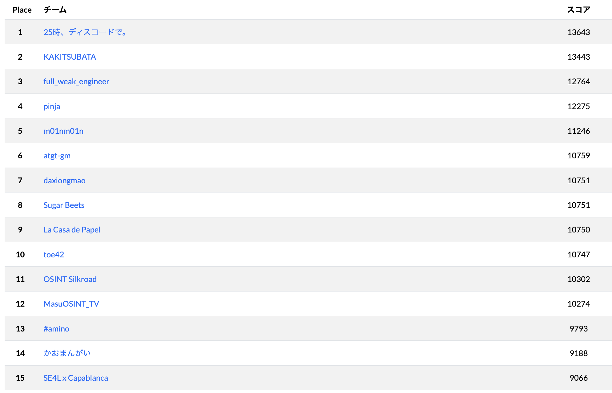

# DIVER OSINT CTF 2025

## Official Writeups

### welcome

- [welcome](./welcome/welcome/README.md)

### introduction

- [bx](./introduction/bx/README.md)
- [document](./introduction/document/README.md)
- [finding_my_way](./introduction/finding_my_way/README.md)
- [flight_from](./introduction/flight_from/README.md)
- [hidden_service](./introduction/hidden_service/README.md)
- [louvre](./introduction/louvre/README.md)
- [night_accident](./introduction/night_accident/README.md)
- [p2t](./introduction/p2t/README.md)
- [ship](./introduction/ship/README.md)

### geo

- [Afghanistan](./geo/Afghanistan/README.md)
- [Talentopolis](./geo/Talentopolis/README.md)
- [advertisement](./geo/advertisement/README.md)
- [convenience](./geo/convenience/README.md)
- [elevator](./geo/elevator/README.md)
- [hole](./geo/hole/README.md)
- [night_street](./geo/night_street/README.md)
- [what3slashes](./geo/what3slashes/README.md)

### recon

- [00_engineer](./recon/00_engineer/README.md)
- [01_asset](./recon/01_asset/README.md)
- [02_recruit](./recon/02_recruit/README.md)
- [03_ceo](./recon/03_ceo/README.md)
- [04_internal](./recon/04_internal/README.md)
- [05_designer](./recon/05_designer/README.md)
- [06_leaked](./recon/06_leaked/README.md)

### transportation

- [36_years_ago](./transportation/36_years_ago/README.md)
- [air2air](./transportation/air2air/README.md)
- [listen](./transportation/listen/README.md)
- [next_train](./transportation/next_train/README.md)
- [platform](./transportation/platform/README.md)
- [sanction](./transportation/sanction/README.md)

### history

- [bridge](./history/bridge/README.md)
- [internment](./history/internment/README.md)

### company

- [bid](./company/bid/README.md)
- [expense](./company/expense/README.md)

### hardware

- [UART](./hardware/UART/README.md)
- [phone](./hardware/phone/README.md)

### military

- [object](./military/object/README.md)
- [radar](./military/radar/README.md)
- [worker](./military/worker/README.md)

### report

- [unknown_aircraft](./report/unknown_aircraft/README.md)

## 統計情報

* user: 1658
* team: 853
* challenges: 41

