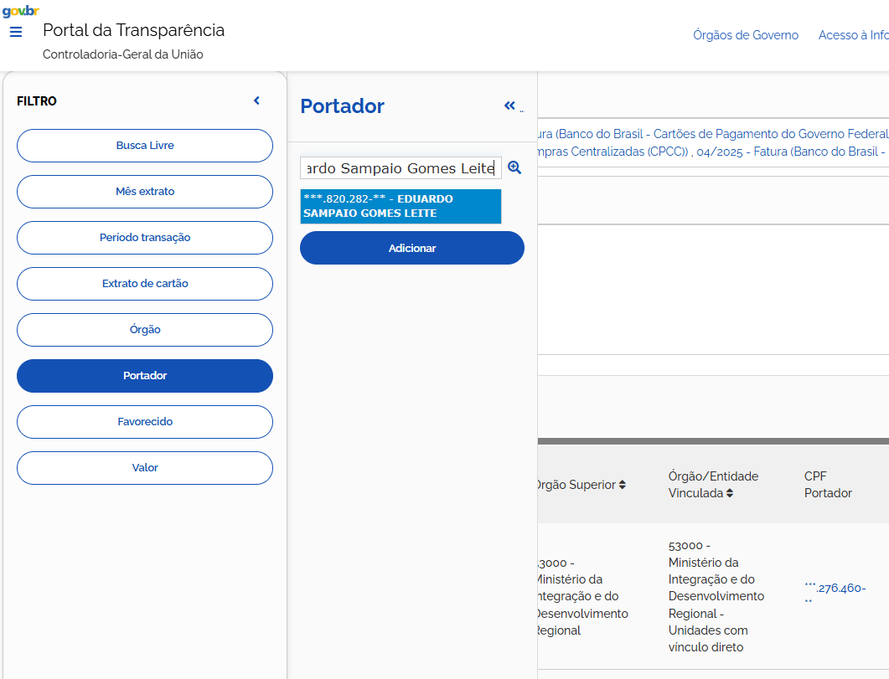
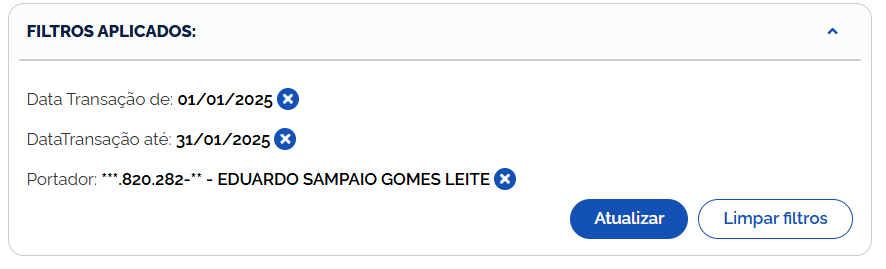

# expense

## 問題文

2025年1月、São Miguel do Guamáの市長が、ある食品関連会社にクレジットカード決済で支払った金額（現地通貨）を答えよ。  
Flag形式: `Diver25{1234.56}`（通貨記号/コードは不要）

Answer the amount (in local currency) paid by the mayor of São Miguel do Guamá to a food-related company by credit card payment in January 2025.  
Flag Format: `Diver25{1234.56}` (Currency symbol or code not required)

## 難易度

medium / 499 point (13 solves)

## 解法

`São Miguel do Guamá` で Google 検索すると、これはブラジルにある市であるとわかる。[同市の公式サイト](https://saomigueldoguama.pa.gov.br/)にアクセスすると、[市長に関する情報のページ](https://saomigueldoguama.pa.gov.br/o-governo/prefeito/)から以下の記述が読み取れます。

> Eduardo Sampaio Gomes Leite, mais conhecido como Eduardo Pio X, nasceu no dia 31 de dezembro de 1983, no município de Jacundá.  
> （Google 翻訳）エドゥアルド・サンパイオ・ゴメス・レイテ、通称エドゥアルド・ピオ X は、1983 年 12 月 31 日にジャクンダ市で生まれました。サン・ミゲル・ド・グアマの現市長であり、ブラジル民主運動党 (MDB) に所属している。

つまり、**Eduardo Sampaio Gomes Leite** が市長の名前であるとわかります。

ブラジルにおいて、政治家の支出はどのようなデータセットから参照できるのでしょうか。

`Brazil politician expenses` といったワードで検索してみましょう。すると、独立系ニュースサイト "Congresso em Foco" による "[Transparency Card](https://campaignsoftheworld.com/tech-innovations/transparency-card/)" という取り組みがヒットします（この取り組みは[2024 年の D&AD 賞を受賞](https://www.dandad.org/awards/professional/2024/238055/transparency-card/)しているため、ご存じの方もいるかもしれません）。

Transparency Card は、擬似的なクレジットカードを Apple Wallet などに登録することで、政治家の支出をリアルタイムで監視することが可能という取り組みです。この[紹介映像](https://www.akqa.com/work/congresso-em-foco/transparency-card/)の中で以下のような記述があります。

> Politician's spending data is open by **Brazilian law**.  
> Though they intentionally made it **extremelly complex to access**.

アクセスが複雑とされていますが、少なくとも法令によって元となるデータが公開されているはずです。このような行政情報は現地語のみで公開されていることも多いため、一旦ポルトガル語に切り替えていきましょう。先ほどの Congresso em Foco による取り組みはポルトガル語で **Cartão da Transparência** と表記されます。

- [Cartão da Transparência Congresso em Foco](https://www.youtube.com/watch?v=pwfZXfdhGlE)

`Cartão da Transparência` で Google 検索してみると、ブラジル連邦政府の情報公開サイトがヒットします。

- [Cartão de Pagamento do Governo Federal](https://portaldatransparencia.gov.br/cartoes)

これは連邦政府が契約する、法人カードの経費情報を公開するサイトです。可視化や検索機能が備わっているようなので、**Consulta Detalhada**（詳細を検索する）というボタンをクリックしてみましょう。

ちょっと複雑そうですが、翻訳を通せば読めるはずです。問題文に合わせて、以下の条件で検索してみましょう。

- **Período transação**（取引期間）: 01/01/2025 - 31/01/2025
- **Portador**（名義人）: `Eduardo Sampaio Gomes Leite`

フィルタを適用して検索しましょう。

すると、 **2025 年 1 月 17 日** に、**BURITI DISTRIBUIDORA DE ALIMENTOS LTDA** という企業に支払った記録が 1 件ヒットします。

この企業名を Google 検索してみると、食品販売会社であることがわかり、問題の条件を満たします。

- https://empresas.serasaexperian.com.br/consulta-gratis/BURITI-DISTRIBUIDORA-DE-ALIMENTOS-LTDA-17490191000110

これより、先ほどの検索結果でヒットした金額が Flag となります。

**Diver25{1.593.081,94}**

## 出題意図

各国の政府・行政によるオープンデータを検索するノウハウを得てもらうための問題です。また、日本語を母語話者とする参加者に対する意図的な language barrier を設定する意図もあります。
