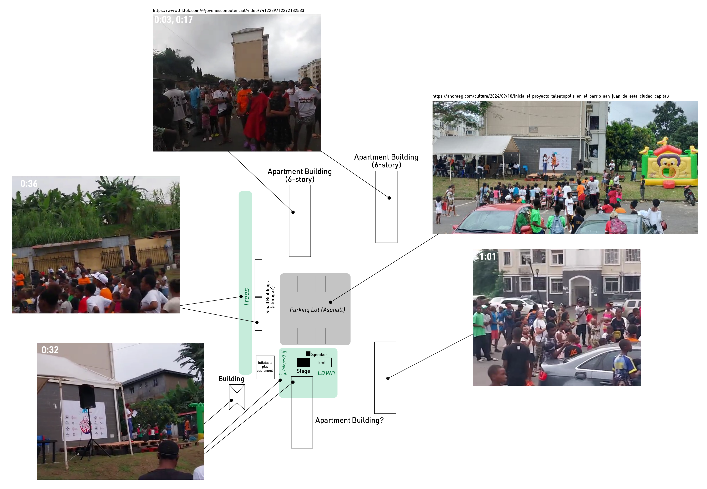
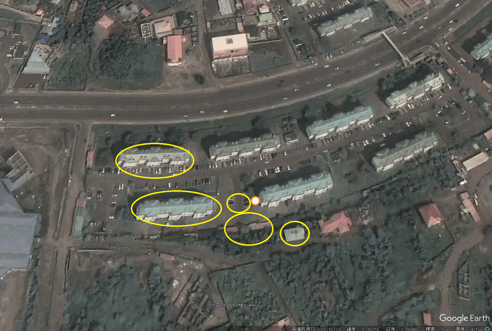

# Talentopolis

## 問題文

記事 / Article:  
https://www.guineaecuatorialpress.com/noticias/primera_edicion_de_talentopoli  

"Primera edición de Talentopolis" という記事内に登場するステージの位置を答えよ。  

Answer the location of the stage appeared in the article titled "Primera edición de Talentopolis".

## 難易度

medium / 472 point (53 solves)

## 解法

まず、記事内の情報から、赤道ギニアの San Juan de Malabo という地区にあることがわかります。画像の Exif には特に有用なデータはありません。

また、イベント名 **Talentopolis** や主催団体名 **JPL (Jóvenes con Potencial de Liderazgo)**がわかります。この情報から検索すると、[Instagram のアカウント](https://www.instagram.com/jplentertainmenteg/reels/)が発見できます。

記事内の **Ver la galería** を選択すると表示される別の画像ではっきりとわかるロゴと、Instagram 内のロゴが一致することがわかります。しかしこれだけでは場所を特定することはかなり困難です。

`San Juan de Malabo Talentopolis` で Google 検索すると、[Inicia el proyecto Talentópolis en el barrio San Juan de esta ciudad capital](https://ahoraeg.com/cultura/2024/09/10/inicia-el-proyecto-talentopolis-en-el-barrio-san-juan-de-esta-ciudad-capital/) というページに別角度かつ鮮明な画像もありますが、直接的に場所に辿りつける情報はありません。

ここで、先ほどのロゴを Google Lens で検索すると、TikTok に [@jovenesconpotencial (Talentópolis_JPL24)](https://www.tiktok.com/@jovenesconpotencial/) というアカウントがあることがわかります。この中で、[2024 年 9 月 9 日に投稿された動画](https://www.tiktok.com/@jovenesconpotencial/video/7412289712272182533)にはステージ周辺の場所や様々な人の姿を確認できます。投稿日、背景の建物の壁やステージの床、イベント用の壁紙的なものからも、記事との一致が確認できます。

また、`San Juan de Malabo Talentopolis` の検索結果から、[この地域で交通事故が発生したニュース](https://ahoraeg.com/sociedad/sucesos/2022/05/22/brutal-accidente-de-circulacion-en-el-barrio-san-juan-de-malabo/)も入手でき、同じ集合住宅が写っていることが確認できます。

ここまで得られた写真や映像を用いて、場所の特定を考えます。  
まず、ステージの前には縦方向に駐車スペースが向かい合って設置されており、奥に 2 棟の中層の集合住宅（6 階建て）がみられます。ステージから見て左手には倉庫のような建造物があり、その上には緑（木）が続きます。ステージから見て右手には奥の建物と類似する集合住宅があり、出入口 2 箇所と駐車スペースがあります。また、このステージの背後は建物であり、これらの集合住宅とよく似た外見をしているようです。さらに、ステージに向かって右奥には少し小さめの、屋根が灰色～黒色の建物が少し高い位置にみられます。

図に起こすと以下のようになります。

赤道ギニアは Google Maps、OpenStreetMap、その他の地図サービスの充実度は低く、ストリートビューや口コミ、ユーザー投稿画像などもほとんどありません。そのため、衛星画像を活用して、このような場所がないかを探索します。

まずはこの地域が地図上でどこにあるかを特定します。主に 2 つのアプローチがあるでしょう（これ以外の方法もあると思います）。

- `San Juan de Malabo` を[OpenSteetMap で検索する](https://www.openstreetmap.org/search?query=San+Juan+de+Malabo&zoom=18)
- San Juan de Malabo に関するニュースを検索し、場所を探す（例: [ショッピングセンターに関する記事](https://www.guineaecuatorialpress.com/noticias/inauguracion_del_afri_mall_de_malabo)）

上記の特徴に当てはまるのは、"Urbanización San Juan"とある集合住宅地域のうち、道路南側の地域となります。ここで、緑の多いエリアがステージから見て左手にあることから、おそらく建物の西側の端をステージにしていると推定できます。駐車スペースの特徴、ステージ後方奥にある黒っぽい屋根の建物の位置及び大きさ、ステージから正面に見える建物の数が 2 つ程度であることから、選択肢を絞り込めます。

これより、上図で示した地点（3.737577, 8.796551）から半径 30m の範囲を正解としています。

