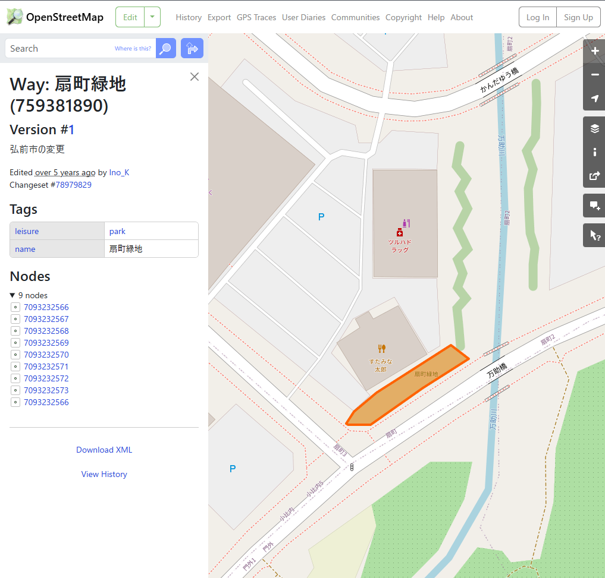

# convenience

## 問題文

青森県内に、公園とコンビニ、スーパーマーケットが互いに約100m圏内に存在する場所がいくつかある。また、これはOpenStreetMapで確認可能である。  
この条件を満たす **公園** のうち、**最南端** のものについて、OpenStreetMap上での Way Number を答えよ。  
なお、「公園」の定義は、OpenStreetMap上で "park" (`leisure=park`) と分類されているものに準拠する。  
Flag形式: `Diver25{123456789}`

There are several locations in Aomori Prefecture (青森県) where a park, a convenience store and a supermarket exist within approximately 100 metres of each other. This can be also confirmed on OpenStreetMap.    
Answer the Way Number (on the OpenStreetMap) of the **southernmost** of these **parks** that satisfy this condition.  
The definition of "park" conforms to that classified as "park" (`leisure=park`) on the OpenStreetMap.  
Flag Format: `Diver25{123456789}`

[配布ファイル](./public)

## ヒント

1. 「互いに約100m圏内に存在する」の例は添付画像を参考にすること。 / Regarding the example of "exist within approximately 100 metres of each other", refer the attached image.

## 難易度

easy / 462 point (63 solves)

## 解法

問題文には OpenStreetMap で確認できると記載されています。何か便利なツールがないか探してみましょう。 `OpenStreetMap search` と Google 検索すると、Bellingcat が開発した以下のツールがヒットします。

[Bellingcat OpenStreetMap search](https://osm-search.bellingcat.com/)

このツールで Selected features の欄で `Park` `Convenience Store` `Supermarket` を設定し、Maximum distance between features
の欄で `100m` を設定します。続いて、Search area で日本の青森県を表示し、Search を実行します。

すると、4 件ほどヒットします。緯度経度から `40.58443, 140.50016` の **扇町緑地** が最南端であると判断できます。

OpenStreetMap にその座標を入力し、緑地の上で右クリックし、"Query Features" をクリックします。（参考: [DIVER OSINT CTF 2024 "osprey2"](https://github.com/diver-osint-ctf/writeups/blob/main/2024/military/osprey2/README.md)）

ここから得られる **759381890** が Way の番号です。

**Diver25{759381890}**

## 出題意図

OSM は網羅性では Google Maps に劣るものの、地物にさまざまなタグがあることから、検索を行う時には強力な情報源になります。ツールを知り、実際に検索を回して条件に合致する場所を探す体験をしてほしいという意図で出題しました。

