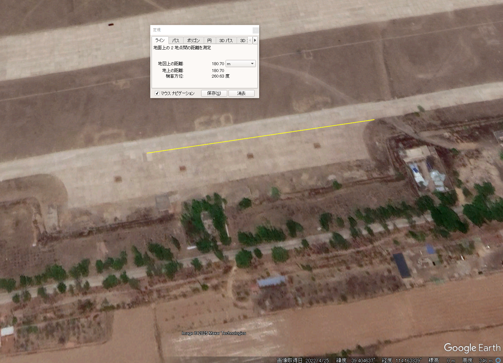

# hole

## 問題文

この穴があった場所はどこか。  
Where was this hole located?

[配布ファイル](./public)

## 難易度

medium / 449 point (72 solves)

## 解法

画像には "6m" "2.5m" というサイズが書かれた穴が写っています。また、右下の文字を Google Lens を用いた OCR によって書き起こすと、

> \*使用飞跃功能时,请遵守官方功能操作指示

という中国語の文字列が得られます。Google 翻訳などを使用すると「※Leap 機能を使用する場合は、公式の機能操作手順に従ってください。」という意味であると判明します。

そこで、`使用飞跃功能时,请遵守官方功能操作指示 2.5m 6m` と Google 画像検索すると、BYD 社の**[仰望 U9](https://en.wikipedia.org/wiki/Yangwang_U9)** という自動車の機能を説明する記事がヒットします。

https://www.msn.com/zh-cn/news/other/%E8%BF%99%E4%B8%8D%E6%98%AF%E7%A7%91%E5%B9%BB%E7%94%B5%E5%BD%B1-%E8%BF%99%E6%98%AF%E7%A7%91%E6%8A%80%E5%88%9B%E6%96%B0-%E4%BB%B0%E6%9C%9Bu9%E5%AE%83%E7%9C%9F%E7%9A%84%E9%A3%9E%E8%B7%83%E8%B5%B7%E6%9D%A5%E4%BA%86/ar-AA1x5Yg5

`仰望 U9` や `BYD U9 Leap` などで Google 検索すると[動画](https://www.youtube.com/watch?v=zIKAn8yDkpA)がいくつか見つかります。序盤で **山西大同** と表示され、空港らしき場所の空撮映像が含まれていることが分かります。`山西大同` を Google 検索すると、山西省大同市がヒットします。

そこで、Google Maps で大同市のエリアを確認した上で、衛星写真から空港を探します。すると、 `39.404463, 114.157173` 付近に、誘導路の形状や周囲の道路の形状が一致した空港が見つかります（灵丘武灵机场、平型关通用机场などと呼ばれる空港のようです）。

そこで、先ほどの動画に着目してみましょう。工事中などの違いはあるものの、空港全景や誘導路の配置は現時点で Google Maps に表示されるものと一致しているようです。

0:25 ごろから、車と障害物を上空から撮影したシーンがあります。この中で車の停車位置から穴まで 200m、穴から次の障害物まで 180m であることが示されます。画面下部に表示される広い場所は駐機場のようです。

Google Earth で空港の南側にある駐機場（`39.404729, 114.163978` 付近）の距離を測定してみると、動画と一致しているようです。

これより、この駐機場の中程にある誘導路上の 39.404831, 114.163865 付近が Flag となります。許容範囲は広く設定してありますが、空港内の全く別の場所が示された場合は不正解としています。

## 出題意図

昨年に引き続き、比較的最近改修されたマイナーな空港を見つける問題です。本問題のねらいは2つあります。  

どのような国でもそうですが、新しい地物は衛星画像や地図に反映されていないことがあります。また、空港や軍事施設、刑務所などはオンライン地図サービスでモザイクが掛けられている例がありますが、別のサイトでは通常通り表示されているということも多々あります（今回はその対象ではありませんが）。  
そのため、複数の地図サービスを併用しながら目的の場所を探索するのは重要な習慣といえるでしょう。

また、ジオロケーションでは、限られた写真・映像と衛星画像を比較して場所を同定する必要が生じるケースも多々あります。  
CMの限られた映像を基に、似たような景色の中から一致する場所を同定することはそのための訓練になると考えています。