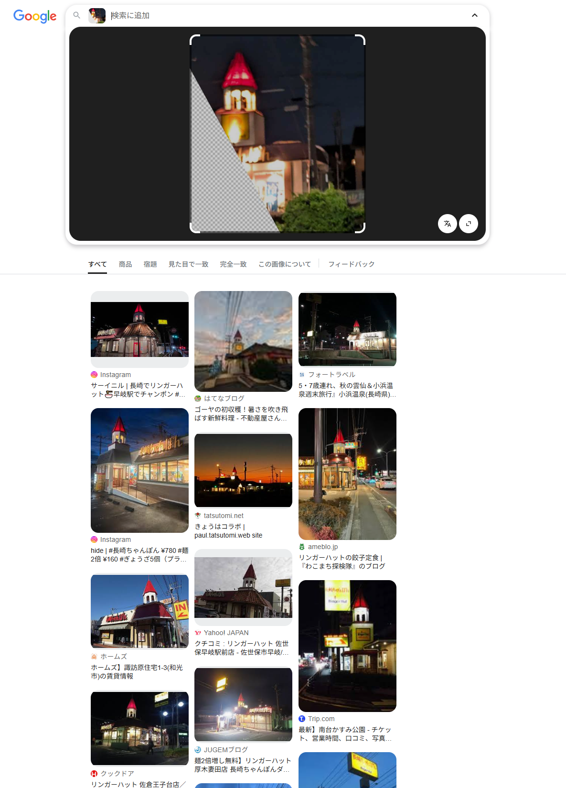

# night_street

## 問題文

画像の中心に写っている茶色の2階建ての建物に入る施設の正式名称を現地語表記で答えなさい。    
Flag形式: `Diver25{施設名}`（例: `Diver25{お台場海浜公園前郵便局}`）  
**注意: この問題を解く際、外部サイトへの機械的なアクセスやスクレイピングは禁止します。また、それらを行う必要はありません。** ただし、ブラウザから手動で取得できる情報や、公開されているAPIサービスやデータセットの利用は問題ありません。

Answer the official name of the facility that will be housed in the two-story brown building in the center of the image (**in local language**).  
Flag Format: `Diver25{Facility Name}` (e.g. `Diver25{お台場海浜公園前郵便局}`)  
**Warning: Mechanical access or scraping of external sites is prohibited when solving this challenge. Nor are you required to do so.** However, there is no problem with using public API services, public datasets and information retrieved from the web browser by (literally) your hand.


[配布ファイル](./public)

## ヒント

1. The church-like building on the left is apparently a Japanese restaurant chain.

## 難易度

hard / 428 point (86 solves)

## 解法

傾きを補正した上で画像左手の建物を Google Lens で検索すると、「リンガーハット」というチェーン店であることがわかります。



画面中央の建物の緑に光る看板文字は、Lens ではわかりません。日本語が得意な方であれば、可読部分は「クリニック」と当たりをつけることができると思われます。そうでなくでも、前述のリンガーハットが日本にあることから日本語だと仮定して、[ひらがな](https://en.wikipedia.org/wiki/Hiragana)や[カタカナ](https://en.wikipedia.org/wiki/Katakana)の一覧を確認することで読み取れるでしょう。また、プロンプトを工夫して LLM などに読み込ませることで解答できるかもしれません。

また、画像の手前側をみると、中央分離帯がある片道 2 車線道路で、コンクリートで舗装されていることが特徴的であることがわかります。  
ここで、リンガーハットの店舗を調べると 2025 年 5 月時点で 564 店舗あり、素直に調査をしていれば日が暮れてしまうかもしれません。リンガーハットとクリニックが隣接する条件から、Overpass Turbo 等のツールを用いて絞り込みを行うこともできますが、画像のような店舗は発見できません（結論からいえば、この店舗は OSM にリンガーハットとして登録されていないためです）。

そこで、リンガーハットの全店舗の位置情報を取得し、医療機関の位置情報データと比べて近接性を計測することで探索数を減らすアプローチを考えます（overpass turbo などで行っていることを、手元でやってみるということです）。
リンガーハットの全店舗の位置情報は、[マピオン](https://www.mapion.co.jp/phonebook/M01010CC15/)などで簡単に入手できます。幸い、全国を見ても 6 ページのみなので、これをコピペすれば住所を得られます。適当なジオコーダを利用することで、緯度経度の情報を得られます。日本国内を対象にしたジオコーダには、例えばデジタル庁が無償で公開しているものがあります（[abr-geocoder](https://lp.geocoder.address-br.digital.go.jp/)）。

医療機関の位置情報は、国土地理院の[国土数値情報ダウンロードサービス](https://nlftp.mlit.go.jp/ksj/gml/datalist/KsjTmplt-P04-v3_0.html)から入手できます。これら 2 つのデータ間で距離行列を取ったり、リンガーハットから適当な距離（誤差などを考慮して 100m 程度）を検索範囲として、含まれる医療機関を探し、「クリニック」がつくものに絞るなどすると、絞り込めます。

地理空間情報に慣れている方であれば、QGIS などを使用してもかまいませんが、ここでは abr-geocoder の API を利用しつつ、Python スクリプトを書いていくことにします。
前述の住所を整形して CSV ファイルとし、医療機関の GML ファイルを用意します。Node.js と Python の実行環境を整えた上で、以下の操作を実施します。

```sh
# ジオコーダの準備
npm install -g @digital-go-jp/abr-geocoder
abrg download
abrg serve start

# スクリプトで使用するライブラリの準備
pip install requests geopy xmltodict tqdm
```

運営チームにて LLM（GPT o3）に生成させたコードは以下の通りです。以下のような要件をプロンプトで示しています。

- CSV と GML ファイルを組み合わせて、ジオコーディングしながら近傍の店を探索したい
- 医療機関は `クリニック` という文字列を含む
- 無駄な探索を省くため、対象のリンガーハットと同一市町村の医療機関のみを検索
- 明確に `フードコート` と住所に含まれているものを除外する

```py
#!/usr/bin/env python
# -*- coding: utf-8 -*-
import csv, json, math, requests, xmltodict, re
from pathlib import Path
from geopy.distance import distance
from tqdm import tqdm
from lxml import etree
from collections import defaultdict

# ====== 設定 ======
API_ROOT   = "http://localhost:3000/geocode"
CSV_REST   = Path("ringerhut.csv")
GML_FILE   = Path("P04-20.xml")
OUT_CSV    = Path("proximity.csv")
MAX_METERS = 100
# ===================

def geocode(addr: str):
    r = requests.get(API_ROOT, params={"address": addr}, timeout=10)
    r.raise_for_status()
    data = r.json()
    if not data or data[0]["result"] is None:
        return None
    return data[0]["result"]

def load_restaurants():
    out = []
    with CSV_REST.open(encoding="utf8") as f:
        reader = csv.reader(f)
        for name, addr, *_ in tqdm(reader, desc="Geocoding restaurants"):
            if "フードコード" in addr:
                continue

            res = geocode(addr)
            if not res:
                continue

            muni = res.get("city") or res.get("ward")  # 市町村 or 特別区
            out.append({
                "name": name,
                "address": addr,
                "lat": res["lat"],
                "lon": res["lon"],
                "muni": muni,
            })
    return out

MUNI_RE = re.compile(r"^(.*?[市区町村])")     # 先頭から最初の 市/区/町/村 まで

def load_hospitals_grouped():
    parser = etree.XMLParser(recover=True, encoding="utf-8")
    root   = etree.parse(str(GML_FILE), parser).getroot()

    ns = {
        "gml":  "http://www.opengis.net/gml/3.2",
        "ksj":  "http://nlftp.mlit.go.jp/ksj/schemas/ksj-app",
        "xlink":"http://www.w3.org/1999/xlink",
    }

    # (1) <gml:Point> を id → (lat,lon)
    points = {}
    for pt in root.findall(".//gml:Point", ns):
        pid = pt.get("{http://www.opengis.net/gml/3.2}id")
        pos = pt.findtext("gml:pos", namespaces=ns)
        if pid and pos:
            lat, lon = map(float, pos.strip().split())
            points[pid] = (lat, lon)

    # (2) MedicalInstitution
    grouped = defaultdict(list)
    for mi in root.findall(".//ksj:MedicalInstitution", ns):
        name = mi.findtext("ksj:medicalInstitutionName", "", namespaces=ns)
        if "クリニック" not in name:
            continue
        addr = mi.findtext("ksj:address", "", namespaces=ns)
        muni_match = MUNI_RE.match(addr)
        if not muni_match:
            continue                         # 町村名抽出失敗はスキップ
        muni = muni_match.group(1)           # 例: '千代田区'

        href   = mi.find("ksj:position", ns).get("{http://www.w3.org/1999/xlink}href").lstrip("#")
        coords = points.get(href)
        if not coords:
            continue
        lat, lon = coords
        grouped[muni].append({
            "name": name, "address": addr, "lat": lat, "lon": lon
        })
    return grouped

def main():
    rests        = load_restaurants()
    hosp_by_muni = load_hospitals_grouped()
    rows = []

    for r in tqdm(rests, desc="Matching"):
        candidates = hosp_by_muni.get(r["muni"], [])
        for h in candidates:
            if distance((r["lat"], r["lon"]), (h["lat"], h["lon"])).meters <= MAX_METERS:
                rows.append({
                    "ringerhut_name":    r["name"],
                    "ringerhut_address": r["address"],
                    "medical_name":      h["name"],
                    "medical_latlon":    f'{h["lat"]},{h["lon"]}',
                    "distance_m":        round(distance((r["lat"], r["lon"]), (h["lat"], h["lon"])).meters, 1)
                })

    # 出力
    with OUT_CSV.open("w", newline="", encoding="utf8") as f:
        w = csv.DictWriter(f, fieldnames=rows[0].keys())
        w.writeheader(); w.writerows(rows)

    print(f"✔  {len(rows)} 件を書き出しました → {OUT_CSV}")

if __name__ == "__main__":
    main()

```

1 件のリンガーハットに対して、条件を満たす複数の医療機関があった場合、それぞれ列挙するコードになっているため、以下のようにして重複したリンガーハットを弾くと見やすくなるでしょう（本来は上記のコード側で対応すべきですが）。

```bash
# bash
awk -F',' '
NR==1 { print; next }                       # ヘッダー行をそのまま出力
{
  key = $1 FS $2                            # ringerhut_name + ringerhut_address
  if (!(key in seen)) {
    seen[key] = 1
    print
  }
}
' proximity.csv > proximity_.csv
```

```powershell
# PowerShell
Import-Csv .\proximity.csv |
    Group-Object ringerhut_name, ringerhut_address |
    ForEach-Object { $_.Group[0] } |
    Export-Csv -Path proximity_.csv -NoTypeInformation -Encoding UTF8
```

これらのうち、「イオンモール」や「ゆめタウン」などの大型商業施設の店舗は、与えられた写真の外観からして該当しないので除外できます。この程度の数であれば総当たりで確認することで、与えられた写真と合致する店舗および病院を特定することができるでしょう。

これより、「リンガーハット 名古屋弥富通店」とその隣にある「弥富通クリニック」がこの写真の場所となります。

もちろん、不慣れな状態でスクリプトを書く手間を考えると地道に全店舗調査することも当然選択肢に入ります（昨年の鳥貴族の問題よりも店舗数としては少ないでしょう）。その際は、日本では珍しいコンクリート舗装の片道 2 車線道路沿いに立地するという条件をうまく活かして、Google Maps 等をめぐると効率が良いと考えられます。Geoguessr が得意な方ならば、電柱などから情報を見て範囲を絞れるかもしれません。

また、"リンガーハットさんのお隣" という検索ワードでクリニックの求人情報が Google 検索にヒットすること（2025 年 6 月時点）なども確認されており、LLM などの利用によって偶然にもぴったり見つかる検索ワードを見つけた方や、Lens の選択範囲を工夫することで見つけた方も居るかもしれません。様々な解法が考えられる問題だと言えるでしょう。

## 出題意図

地理空間情報や各種ツールを活用することによって、条件の悪いジオロケーションに挑んでもらうことをねらいとしています。Google画像検索、Overpass Turboなどは非常に強力なツールではあります。しかしながら、それらはあらゆる場所を容易に特定できるツールではないということを体感しつつ、それならばどうするか？ということを考えてもらうきっかけになれば幸いです。