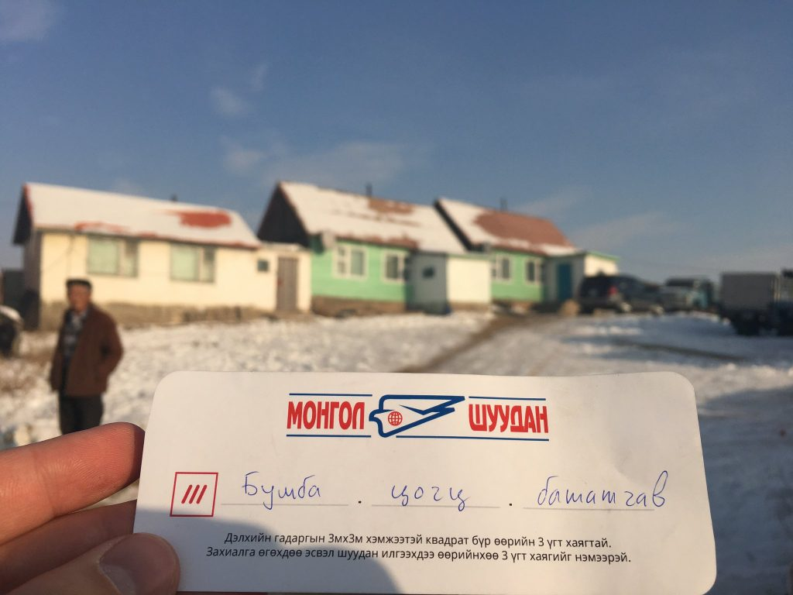
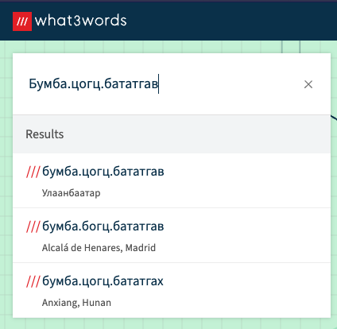
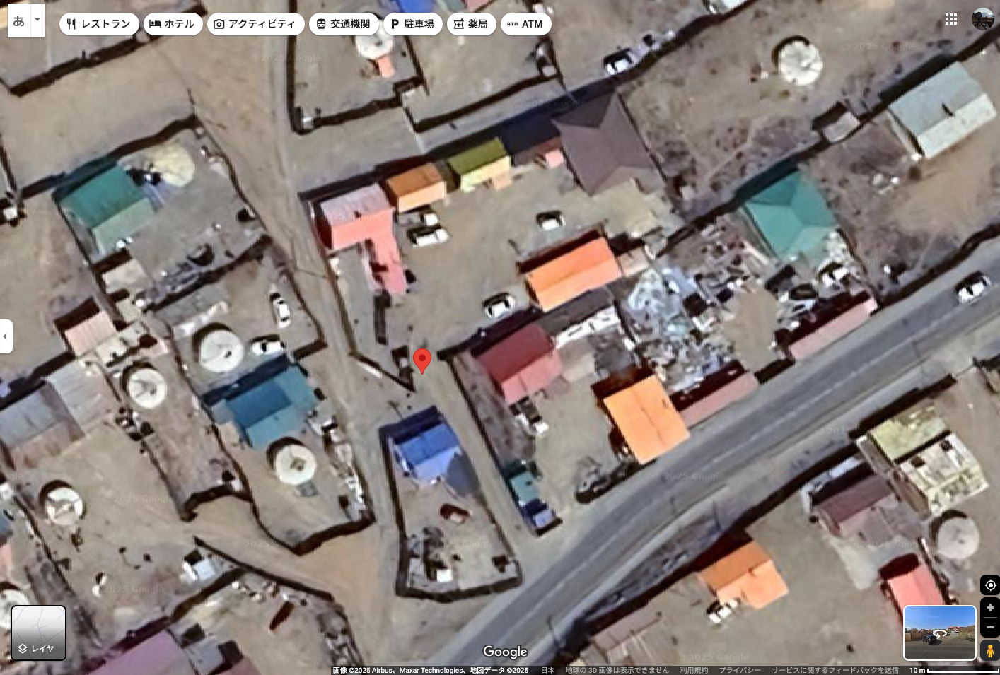
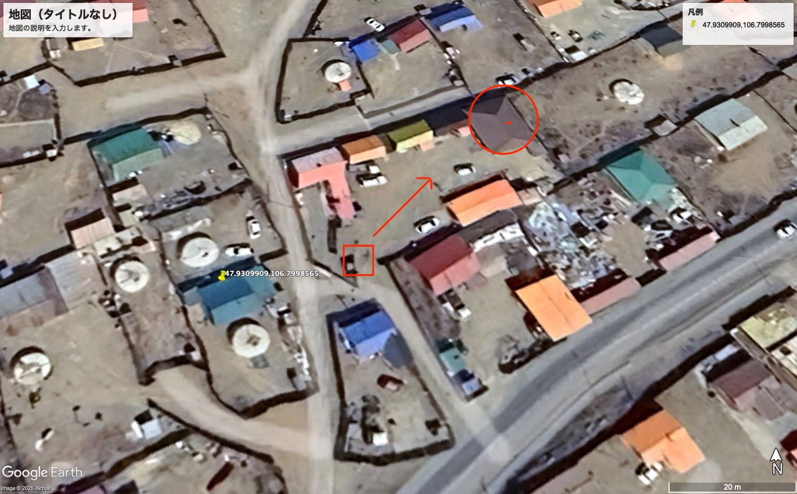
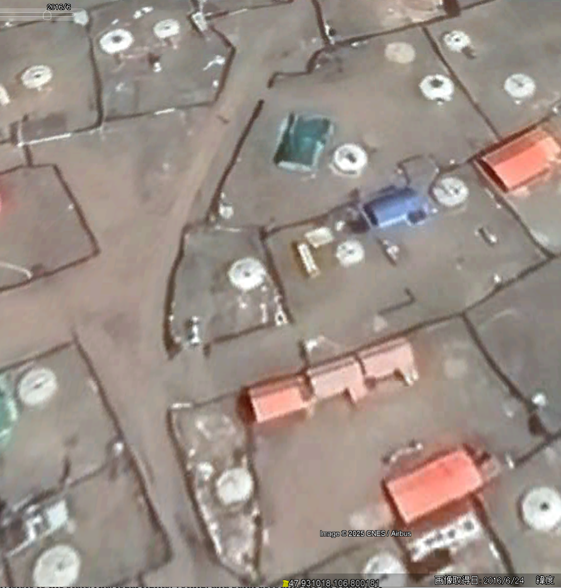
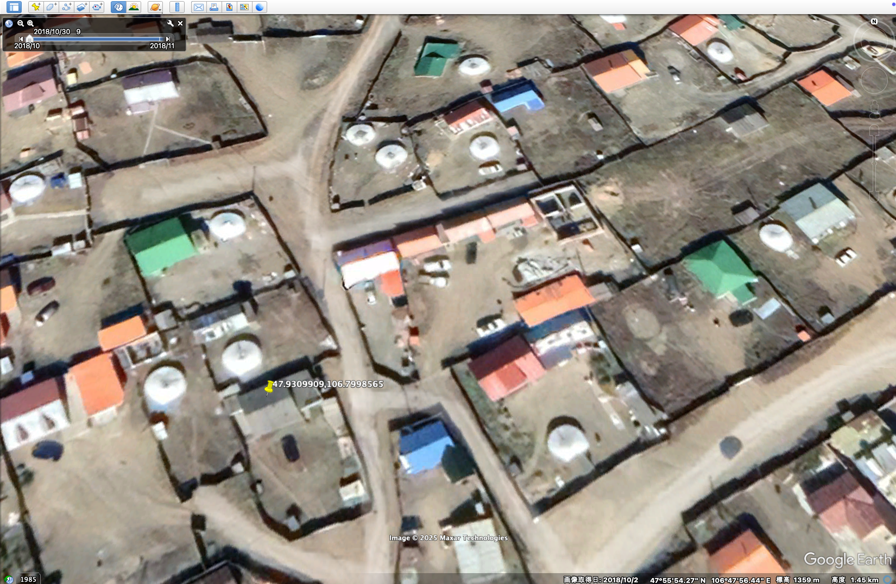

# what3slashes

## 問題文

この画像が撮影されたとき、正面に家が3軒、右手に家が1軒あった。  
それから少し経った、ある月の初旬にこの場所にもう一度訪れてみた。そのときには、正面左側に家が1軒増えていて、正面右側にもう1軒が建設中であった。その時点で、建設中の家に屋根はなかったが、黒っぽい屋根を作る予定だという。  
「ある月の初旬」とは何年の何月のことだろうか。  
Flag形式 : `Diver25{YYYY/MM}` (e.g. `Diver25{2025/06}`)

When this image was taken, there were three houses in front and one on the right.  
Some time later, at the beginning of one of the months, I visited this place again. At that time, one more house had been added to the left side of the front and another was under construction on the right side of the front. At that point, the house under construction did not have a roof, but they were planning to build a blackish roof.
In which year and month is "the beginning of one of the months"?  
Flag Format: `Diver25{YYYY/MM}` (e.g. `Diver25{2025/06}`)

[配布ファイル](./public)

## 難易度

medium / 446 point (75 solves)

## 解法

この画像は以下の記事から引用されたものです。

- [Solving the Global Address Problem](https://www.howwegettonext.com/solving-the-global-address-problem/)

Google Lensで画像を検索すると、[what3words公式サイトにもう少し大きな画像](https://what3words.com/de/news/general/mongol-post)が出てきます。

また、この記事にも書かれている通り、`///` と書かれたマークとその後ろに書かれた文字はwhat3wordsによる座標を表しています。

このカードはモンゴル語（キリル文字）の筆記体で書かれています。そこで、Google LensでテキストをOCRを試みたいのですが、真ん中の単語はうまく読み取れないかもしれません。この部分についてはキリル文字の筆記体（[cyrillic cursive](https://en.wikipedia.org/wiki/Russian_cursive)）を調べて照らし合わせると、`Бумба.цогц.бататгав` という文字列が得られます。  

これをwhat3wordsに入力すると、ウランバートル（Улаанбаатар）の座標（`47.931018,106.800181`）が1件ヒットします。

この場所のGoogle Mapを見ても、画像と同じ場所なのかあまり確信が持てません。しかし、記事の日付や記事に含まれる画像のURLから撮影は2016年ごろと推定され、かつGoogle Mapの撮影日が2025年であるため、この9年で少し変わったのでは？という予想ができます。

また、問題文を見ると「正面に家が1軒増えていて、もう1軒が建設中であった。その時点で、建設中の家に屋根はなかったが、黒っぽい屋根を作る予定だという」という記述があります。もし9年の間に変わったのであれば、以下の画像のように四角い場所に立って矢印の方向を見て、丸い場所にある家のことを言及しているのではないかと考えられます。

Google Earthを用いて過去の衛星画像を取得します。すると確かに2016年6月の時点では家が三軒建っており、与えられた画像と状況が一致します。

そこで、Google Earthで過去に遡ってこの場所の衛星画像を取得します。すると2018年10月2日に撮られた画像が見つかり、奥の黒い屋根の家が建設中であることがわかります。

これより、Flagは以下の通りとなります。

**Diver25{2018/10}**

## 出題意図

日本のオンライン上で what3words は単に面白ギミックとして扱われている感が否めません。本来の用途で住所として利用されているユースケースに触れてもらうために題材として選定しました。また、Google Earthで過去の衛星画像に遡ってもらう手法を体験してもらうという意図もあります。