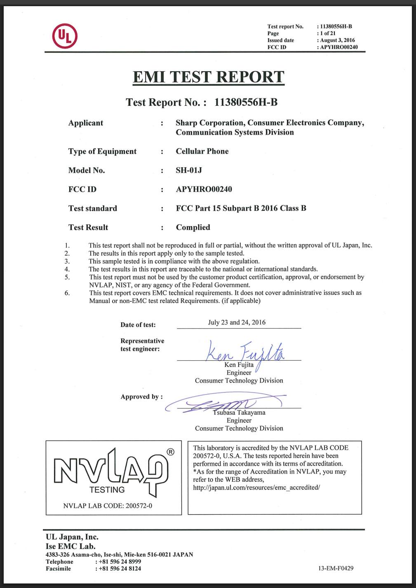
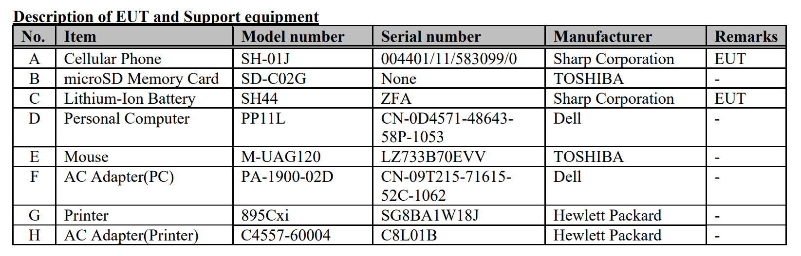

# phone

## 問題文

2016年7月23日～24日、この携帯電話の発売に先立ってEMI試験が行われた。試験は三重県の会社が実施したようだ。その試験に供された端末のシリアル番号を答えよ。  
シリアル番号に `/` や `-` といった記号を含む場合、その記号も含めて記載すること。  
Flag形式（例）: `Diver25{123-45/6789-0}`

An EMI test was conducted prior to the launch of this mobile phone on 23-24 July 2016. The test was conducted by a company in Mie Prefecture (Mie-ken), Japan.  
Answer the serial number of the specific mobile phone that was subjected to that test.  
If the serial number contains symbols such as `/` and `-`, include them.  
Flag Format (example): `Diver25{123-45/6789-0}`


[配布ファイル](./public)

## ヒント

1. シリアル番号は情報源に記載されている通りでよい。 / The serial number should be as listed in the information source.

## 難易度

medium / 441 point (78 solves)

## 解法

携帯電話の EMI 試験に関する記録はどのように手に入れるのでしょうか。`mobile phone EMI test records` などと検索してみると、**FCC Report** のサイトが何件かヒットします。FCC 認証について調べてみると、[アメリカ合衆国の電波・通信に関する認証](https://cend.jp/emc_regulation/basic/fcc.html)であるとわかります。

そこで、この機種についての FCC 認証の情報がオンラインで参照できるのではないかと仮定します。

端末の下部に **SH-01J** という型番が記載されています。`SH-01J FCC` などで検索すると、[当該製品の説明書（92 ページ）](https://fccid.io/APYHRO00240/User-Manual/12-User-Manual-APYHRO00240-pdf-3109246.pdf)や、フリマ・オークションサイトに出品された商品の背面画像などがヒットし、SH-01J の FCC ID が **APYHRO00240** であると判明します。

[FCC の公式サイト](https://www.fcc.gov/oet/ea/fccid)あるいは[FCC 認証の情報をまとめたサイト](https://fccid.io/)で先ほどの ID を検索すると、大量の PDF がヒットします。この中から**Test Report**（テスト報告書）を地道に探していくと、`Pt15B_APYHRO00240_TestReport_11380556H-B` というファイル内に **EMI Test Report** というタイトルが記載されています。また、この報告書は三重県に存在する会社が発行したことが記されています。



報告書を読み進めると 8 ページに以下のような記載があります。

```
Cellular Phone SH-01J 004401/11/583099/0 Sharp Corporation
```



これより、Flag は以下の通りです。

**Diver25{004401/11/583099/0}**

## 出題意図

多くの方にとってあまり馴染みのないであろう情報について調査をしてもらう題材として選定しました。また、全体の問題構成として見た時に、難易度が高いhardware/UARTに繋がる誘導（FCC ID）としても設定しています。