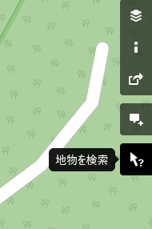
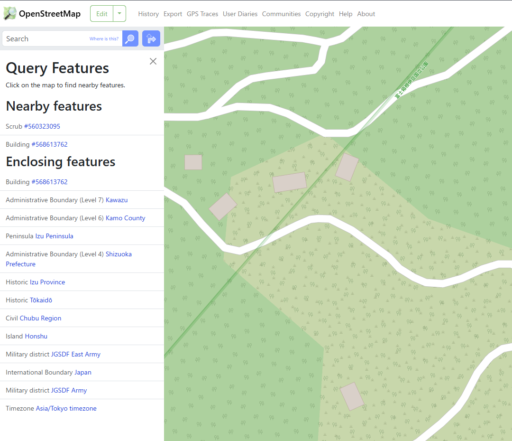
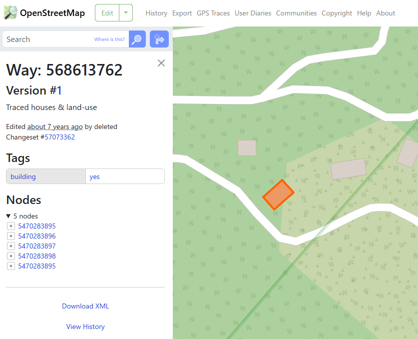

# finding_my_way

## 問題文

`34.735639, 138.994950` にある **建造物** の、OpenStreetMapにおけるWay（ウェイ）番号を答えよ。  
Flag形式: `Diver25{123456789}`

Answer the Way number in OpenStreetMap of the **building** located at `34.735639, 138.994950`.
Flag Format: `Diver25{123456789}`

## ヒント

1. 「建造物」は「地物」の一種である / a "building" is categorized into "features"

## 難易度

introduction / 100 point (408 solves)

## 解法

まず Google Maps で座標を入力してみると、道路（山道）沿いに旅館が存在しており、与えられた座標はその旅館の建物を示していると分かります。

次に、[OpenStreetMap](https://www.openstreetmap.org/)(OSM)で指定された座標を検索すると、こちらも同様に旅館の建物が存在することがわかります。

さて、OSM のウェイ番号とは何なのでしょうか？ `OSM Way Number` などで検索すると、OSM 上の要素（地物）はノード（node）・ウェイ（way）・リレーション（relation）の 3 つに分類されることが分かります（[OSM wiki](https://wiki.openstreetmap.org/wiki/JA:%E8%A6%81%E7%B4%A0)）。

ここで、OSM の画面に戻ってみましょう。画面の右側に「地物を検索 (Query Features)」というアイコンがあります。これをクリックして地物をクリックすると、地物の詳細が表示されます。

ここで表示される建造物（Building）の ID が Flag です。

**Diver25{568613762}**

## 出題意図

CTF中にOSMを利用する問題がいくつかあることから、その誘導としてintroductionで出題しました。