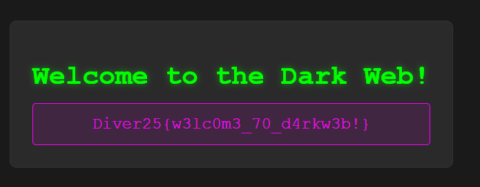

# hidden_service

## 問題文

添付ファイルを確認して、Flagを獲得してください！  
See the attached file and capture the flag!  
Flag形式 / Flag Format: `Diver25{xxxxxxxxxxxxxxxxx}`

[配布ファイル](./public)

## ヒント

1. ルールに記載しているとおり、このCTFでは違法なサービスを利用する必要はありません（合法性の判断は日本国の法令に準拠します）。 / As stated in the rules, there is no need to use illegal services in this CTF (the determination of legality is governed by the laws of Japan).

## 難易度

introduction / 100 point (354 solves)

## 解法

`diverahbwzfukwflslim73j7qtthfkesqvfh42obqk4cxrxwtajk7myd.onion` という文字列が示されています。末尾に書かれている `.onion` とは何でしょうか？

Google 検索してみると、Onion Service を表すトップレベルドメインで、[Tor ネットワーク経由でアクセスできることがわかります](https://support.torproject.org/ja/onionservices/onionservices-2/)。つまり、いわゆるダークウェブの Web サイトを示すものです。

[Tor Browser](https://www.torproject.org/ja/download/)など、ダークウェブへアクセスするツールを使用することで Flag を取得できます。

**Diver25{w3lc0m3_70_d4rkw3b!}**

## 出題意図

脅威分析分野のOSINTにおいては、ダークウェブのデータを調査する必要が生じるケースがあります。そのような例を想定して、ツールとしてのTorに触れてもらうための問題です。

- [Using OSINT and dark web data to safeguard financial services](https://www.silobreaker.com/blog/finance/the-financial-sector-threats-and-prevention-techniques/) - Silobreaker
- [ネットワークセキュリティ｜NTT R&D Website](https://www.rd.ntt/research/JN202112_16446.html)

また、ニュースなどでも、個人情報の漏洩先や非合法情報がやり取りされる場として「ダークウェブ」に言及されることが多々あります。それだけ聞くと、普通にはアクセスできない特殊な空間があるかのように思われるかもしれませんが、Torにさえ接続できれば誰でもアクセスできるものです。また、悪用例が目立つのは事実ですが、国家などによる検閲を回避するために報道機関が.onionのサイトを用意するようなケースもあります（[BBC](https://www.itmedia.co.jp/news/articles/1910/25/news067.html)、[NY Times](https://open.nytimes.com/https-open-nytimes-com-the-new-york-times-as-a-tor-onion-service-e0d0b67b7482)など）。このような状況を鑑みて、Torという技術自体をよく知らずに「怖いもの」「危険なもの」「自分には無縁のもの」として遠ざけるのではなく、OSINTを標榜するのであれば一度自分でTorに触れてほしいというねらいから、introcutionカテゴリで出題しました。

なお、国内外のCTFでも、.onionサイトの出題例があります（TsukuCTF 2022 "Ochakumi"、HEXA OSINT CTF v2 "Herbaceous" など）。OSINT CTFプレイヤーとしても、`.onion` ドメインへのアクセス手法は知っておいて損はないはずです。