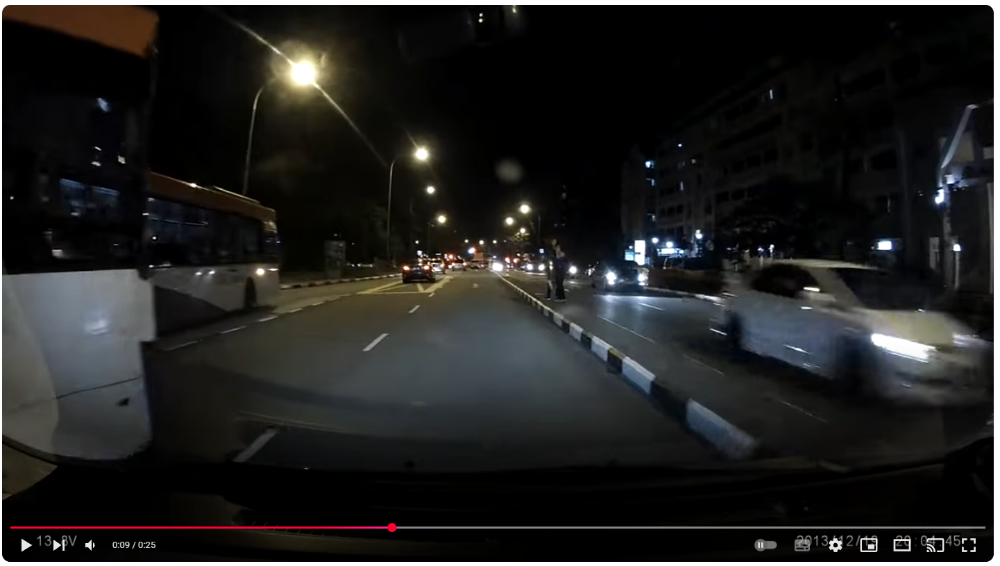
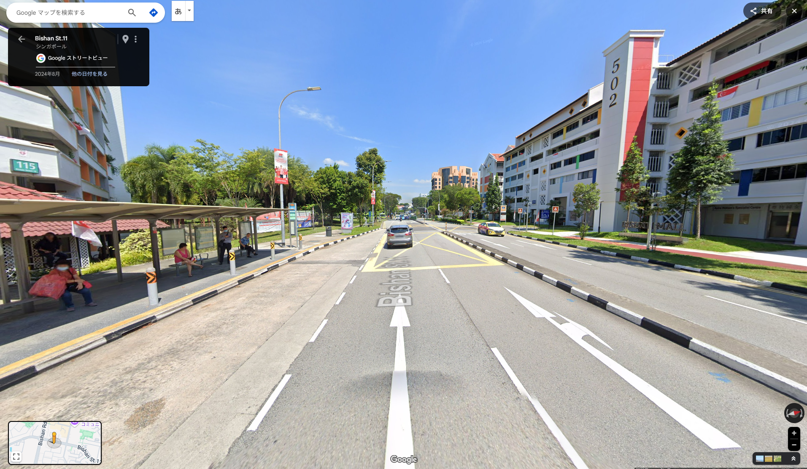
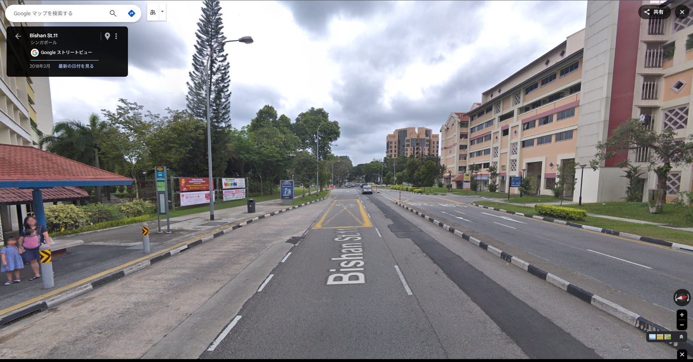

# night_accident

## 問題文

動画 / Video:  
https://www.youtube.com/watch?v=jHgqCpJNL28

この動画で、車とバスが衝突しそうになった場所はどこか。  
In this video, where did the car and bus almost collide?

**content warning:**  
衝突には至らないものの、交通事故のようなシーンがあります  
There are scenes that do not result in a collision, but are similar to a road accident.

## 難易度

introduction / 100 point (269 solves)

## 解法

動画をみると、**SBS Transit** の **52**と **58** という系統名と思われるバスが映っています。また、**52** はバス停から出てきたところのようです。

`SBS Transit` で Google 検索するとシンガポールのバス会社であることがわかります。バスには系統地図がつきものですから、`SBS Transit map` で検索すると、上位のサイトとして [busrouter.sg](https://busrouter.sg/) がヒットします。系統名で検索できるうえに複数の系統を同時に表示できるようですから、52 系統と 58 系統を重ねて表示させます。すると、**Bishan Int**、**Blk 115**、**Blk 501**、**Bishan Stn**、**Opp Bishan Stn**のみが重なることがわかります。

これだけしかないので総当たりで見ていくと、最寄りのバス停は `1.348245, 103.848613` 付近にある Blk 115 であろうとわかります。  
動画を再確認すると、商業施設の駐車場を出てから右折した直後にバスに衝突しそうになったようです。

ストリートビューで見る限りだと、道路のマーキング（黄色いバツ印）が 2 車線にわたっており、一致しません。

しかし、動画の投稿日は 2014 年です。2018 年などに遡ると、道路のマーキングが 1 車線分しかないことが確認可能で、一致することがわかります。

これより、座標を特定できます。

`1.3482, 103.8486`

## 出題意図

交通機関の情報を基に、過去のストリートビューを参照するなどして場所を確認することをねらいとしています。