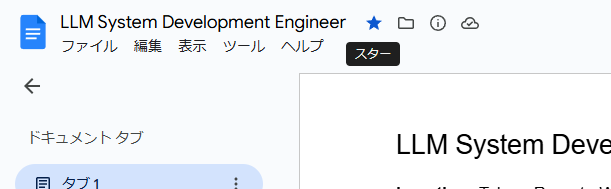
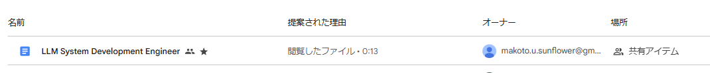
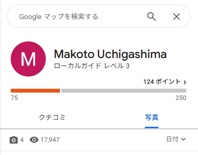

# recruit

## 問題文

**"00_engineer"** の問題で見つかった会社で、採用を担当していると思われる人物の氏名を答えよ。  
Flag 形式: `Diver25{Shigeru Ishiba}` (ローマ字表記)

Answer the name of the person you think is in charge of recruitment at the company found in the **"00_engineer"** challenge.   
Flag Format: `Diver25{Shigeru Ishiba}` (In Latin alphabet. NOT Hiragana, Katakana, Kanji etc.)


## 難易度

medium / 488 point (37 solves)

## 解法

Magneight 社の Web サイトには採用情報ページがありますが、現在は採用中の職種が掲載されていません。

```
https://magneight.com/contact.html
```

しかし、このページを WayBack Machine で確認すると、過去の募集情報が閲覧できます。

過去のページでは、Job Description が Google ドキュメント（Google Docs）にリンクされており、「LLM System Development Engineer」という職種が募集されていたことが分かります。

このドキュメント上には連絡先が記載されていないのですが、このドキュメントの作者を知ることができます。  
Google ドキュメント上でスターを付けてみましょう。



続いて、あなたの Google ドライブに移動してみましょう。すると、ドキュメントの作成者のアドレスが表示されています。



[Epieos](https://epieos.com/)や[GHunt](https://github.com/mxrch/GHunt)などのツールを使うと、このユーザが Google に投稿したレビューが閲覧でき、そこに氏名が掲載されています。



**Diver25{Makoto Uchigashima}**

