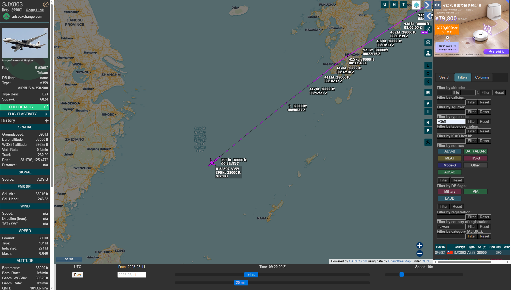
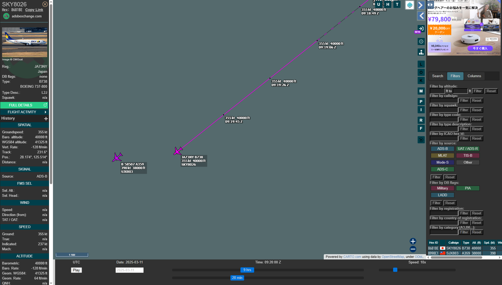

# air2air

## 問題文

動画 / Video:  
https://www.youtube.com/watch?v=wUa5TGj6uxc  
（無音です / No audio）

この動画は2025年3月11日（現地時間）に撮影された。遠くに映っている航空機のコールサインと機体記号を答えよ。  
（撮影者が搭乗している航空機ではない）  
Flag形式: `Diver25{コールサイン_機体記号}`（例: `Diver25{ANA0183_JA381A}`）  

This video was taken on 11 March 2025 (in local time).  
Answer the callsign and registration number of the aircraft seen in the distance.  
(Not the aircraft the person who shot the video is on board)  
Flag Format: `Diver25{CALLSIGN_Registration}`（Example: `Diver25{ANA0183_JA381A}`）

## ヒント

1. 有料の情報源を使う必要はない。 / No need to use paid information.

## 難易度

medium / 495 point (24 solves)

## 解法

与えられた映像からは機体を視認することはできません。強いて言えば、胴体が白く、垂直尾翼に白か黄色の模様が見えるとは言えるかもしれませんが、ここから機体を同定するのは困難です。

映像の 0:16 ごろには、撮影者が搭乗している機体の翼端（シャークレット）が確認できます。このロゴマークを Google Lens で検索すると、台湾の **スターラックス航空**（Starlux Airlines、SJX/JX）であることがわかります。

また、映像の後半では東シナ海上を飛行している様子がわかりますから、[ADS-B Exchange](https://globe.adsbexchange.com/)の[Replay 機能](https://globe.adsbexchange.com/?replay)で 3 月 11 日の東シナ海を辛抱強く探せば、スターラックス航空の機体と並ぶように飛んでいる機体が見つかり、Flag になるはずです。

とはいえ、丸 1 日分の記録を探索するのは大変ですし、見落としも発生してしまいそうです。もう少し探索範囲を絞りたいところです。

特定したい航空機が視認できない以上、撮影者が搭乗している航空機を使って絞り込む方が良さそうです。  
同社は A321neo、A330neo、A350-900 を保有していることが[公式サイト](https://www.starlux-airlines.com/en-JP/experience/walk-into-starlux/our-fleet)に記載されていますが、この航空機はどれでしょうか。

映像の後半で "40A" という座席番号が表示されています。シートマップを見ると、座席に「40 列」がある機種は A330neo と A350-900 が該当します。また、`Starlux fleet`（スターラックス　機材）などで Google 検索して、翼端の形状や塗装に注目すると、A350-900 であることが分かります。  
（A330 はロゴではなくストライプが描かれている。下記リンク参照）

- https://www.planespotters.net/photos/fleet/STARLUX-Airlines/airbus-a330-900
- https://www.planespotters.net/photos/fleet/STARLUX-Airlines/airbus-a350-900

これらの情報を ADS-B Exchange の **Filter** 機能 に反映してみます。  
**Filter by type code** に A350-900 を意味する `A359`、**Filter by country of registration:** に `Taiwan` と入力すると、台湾籍（機体記号 B-xxxxx）の A350-900 だけが表示されるので、これでスピードを上げて Replay を行います。

https://globe.adsbexchange.com/?icao=8991e6&lat=29.879&lon=125.355&zoom=7.8&showTrace=2025-03-11117&trackLabels

3 月 11 日を Replay しつつ、映像の後半部分（機内の画面に映ったマップ）に一致するような場所にスターラックスの A359 が表示されたらフィルターを解除して周囲の航空機を眺める……といったことを行ってみると、09:20:00UTC ごろに、A359 で運航される SJX803 便と、**SKY8026** というコールサインで運航される **JA73NY** が並んで飛行している様子が確認できます。

この日に、この空域で航空機が近接して飛行している状況はあまりなく、機種などを含めて条件を満たすのは上記のフライトであると確定できます。

**Diver25{SKY8026_JA73NY}**

なお、余談ですが、SKY8026 は整備のために台湾の EVERGREEN 社の整備施設に向かっていたものだと思われます。

## 出題意図

昨年に引き続き、ADS-B Exchangeを活用する問題です。  
航空データを用いたOSINTでは、限られた情報から必要な情報を導き出した上で、膨大な航空交通のデータから必要な情報だけを絞り込む場面が多々あります。この問題は、実際に手を動かしながら、その流れを体験してもらうことをねらいとしています。