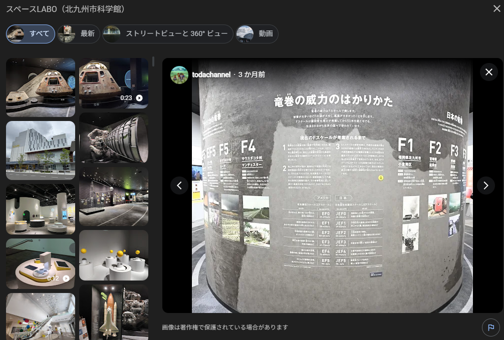

# F3 (100pt / 244 solves)

## 問題文

この解説パネルが展示されている建物を地図で示せ。  
**注意**: パネルに掲示されている、被災している様子が撮影された地点ではありません。  
**content warning**: 災害に関する画像を含みます。

Please indicate the building where this explanatory panel is displayed on a map.
**Note:** This is not the location where the image of the disaster shown on the panel was taken.
**content warning**: This contains an image related to disasters.

## 配布ファイル

- [F3.jpg](./public/F3.jpg)

## 解法

Google LensによるReverse Image Searchを試みると、掲載されている写真ばかりヒットしてしまい、場所が特定しづらいです。

ただし、この写真や `2006年11月7日 北海道佐呂間町` といったワードで検索すると、[北海道佐呂間町竜巻災害](https://ja.wikipedia.org/wiki/%E5%8C%97%E6%B5%B7%E9%81%93%E4%BD%90%E5%91%82%E9%96%93%E7%94%BA%E7%AB%9C%E5%B7%BB%E7%81%BD%E5%AE%B3)に関するものであることがわかります。  
この災害では、竜巻の[藤田スケール](https://en.wikipedia.org/wiki/Fujita_scale)がF3であるとされており、画像上部に掲載されている「F3」と一致します。

また、同様に、右に記載されている内容も[2012年につくば市で発生した竜巻](https://www.jma.go.jp/jma/menu/tatsumaki-portal/tyousa-houkoku.pdf)に関するものであるとわかります。

これは日本国内における竜巻に関する展示ではないかと仮定し、`竜巻 展示 日本` といったワードでGoogle検索します。すると、いくつかの科学館や博物館に竜巻に関する展示が存在することがわかります。  
その中で、[スペースLABO（北九州市科学館）](https://www.city.kitakyushu.lg.jp/contents/11901236.html)に竜巻の展示があることが確認できます。

> 北九州市と科学をテーマにした展示室  
> 高さ約10メートル（国内最大）の大型竜巻発生装置  
> 本市出身の気象学者「ミスタートルネード」藤田哲也博士の顕彰展示  
> 大型スクリーンに手を伸ばして本市の情報を学べる「グーンとキタキュー」　など  
> https://www.city.kitakyushu.lg.jp/contents/11901236.html

「スペースLABO」のGoogle Mapsのレビューを見ると、問題のものと一致するパネルが存在することがわかるため、「スペースLABO」の座標をマップ上で解答すればよいと判断できます。  
なお、同施設が存在する北九州市は藤田スケールを考案した[藤田哲也（Ted Fujita）](https://en.wikipedia.org/wiki/Ted_Fujita)の出身地です。  

設定座標: 33.871795, 130.808788（許容誤差: 50m）