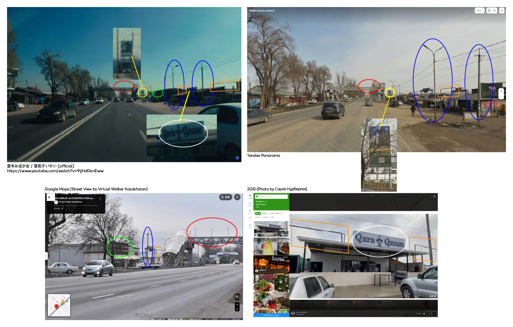

# stargazing (417pt / 104 solves)

## 問題文

動画 / Video: https://www.youtube.com/watch?v=9ijHd0knEww

星街すいせいの楽曲「星をみる少女」のミュージック・ビデオでは、彼女が星空が見える場所へ旅する様子が描かれている。  
このミュージック・ビデオで、道路上の歩道橋が映っているシーンがある。この歩道橋の至近に、近年、カフェがオープンしている。その店名をラテン文字表記で答えよ。  
例えば、カフェの店名が Davis Street Espresso であった場合、Flagは `Diver26{Davis Street Espresso}` となる。  
もし複数のカフェがある場合、歩道橋に最も近いものが答えとなる。

The music video for Hoshimachi Suisei's song "*The Stargazing Girl*" (星をみる少女) depicts her journey to a place where you can see the starry sky.  
In this music video, there is a scene showing a pedestrian overpass over a road. Near this overpass, a café has recently opened. Answer with the name of the café in Latin characters.
For example, if the café name is Davis Street Espresso, the flag should be `Diver26{Davis Street Espresso}`.  
If there are multiple cafes, the one closest to the overpass is the answer.

## 解法

0:58 ごろに登場する航空機を Reverse Image Search すると、カザフスタンの[エア・アスタナ](https://en.wikipedia.org/wiki/Air_Astana)のものであることが判明します。  
背景のターミナルが立派であることから、ある程度大きな空港であると考えられます。同社が拠点としているカザフスタン内の主要な空港（といってもアスタナとアルマトイの2つしかない）をGoogle Earth で確認すると、アルマトイ国際空港の[43.348486, 77.014122](https://maps.app.goo.gl/zwDCAieoT5uTpUnBA)付近と一致することがわかります。

映像の演出上、登場する映像が順番に撮影されたものだとは限りませんが、現時点の手がかりとしては十分でしょう。  
実際、1:13ごろに映る歩道橋をRISし、 `Almaty` や `Алматы` というワードをつけて絞り込むと、類似する外観の歩道橋がヒットすることから、当該シーンはアルマトイの路上を映したものではないかと推測できます。

- [Almaty road trip.Дороги Алматы. Июнь 2024. Kazakhstan. #kazakhstan #roads #almaty](https://youtu.be/ztweFdJKTLQ?si=4ANsYuRRADetePbN&t=213)

きわめて判読しづらいですが、シーンを拡大して明度などを調整すると画面右側の建物に "Qara Qazan" と書かれている白い看板が読み取れます。これが答えであると考えられますが、場所が正しいかどうかを検証します。

`Qara Qazan` でGoogleを検索すると、`@qara.qazan` というTikTokアカウントがヒットします。判読しづらいですが、アイコンが看板と一致しているようにも見えます。
また、以下の投稿を確認すると、`#кафеалматы #кудасходитьалматы #сходималматы #алматы` といったハッシュタグが列挙されており、アルマトイに立地していることがわかります。

https://www.tiktok.com/@qara.qazan/photo/7543239052179410181

中央アジア（CIS諸国）であることから、Yandexを利用すると便利かもしれません。  
`Qara Qazan алматы` で Yandex 検索を行うと、[2GIS](https://en.wikipedia.org/wiki/2GIS)上の以下のページがヒットします。

https://2gis.kz/almaty/branches/70000001101280889/firm/70000001101280890/77.063187%2C43.35042

投稿画像を確認すると、以下のものが店舗外観に類似していると考えられます。

https://2gis.kz/almaty/gallery/firm/70000001101280890/photoId/30258560239088545

Google ストリートビューはありませんが、[Yandexマップのパノラマ画像](https://yandex.com/maps/org/qara_qazan/92586457895/?l=stv%2Csta&ll=77.061481%2C43.359226&panorama%5Bdirection%5D=50.025007%2C1.413406&panorama%5Bfull%5D=true&panorama%5Bpoint%5D=77.062778%2C43.350485&panorama%5Bspan%5D=68.001773%2C26.528857&z=14.38)を確認すると、類似した光景が見られます。

競技としてはこの時点で回答を試みても差し支えありませんが、可能ならさらにVerifyを行います。  
Yandexマップに表示されている光景（2024年撮影）と、ミュージックビデオに登場する光景には差異があるため、別の情報を使用して確認を行います。

"Qara Qazan" の東側には "Султан" という名前のマーケット (Рынок) があります。Yandexパノラマ画像の時点では古いようですが、ミュージックビデオの時点では比較的整備された新しい建物が存在しているように見えるため、この建物が存在していることを確認します。

Google Mapsで近隣に何かないか探すと、近傍のТОО SERILIK-M CONSTRUCTION には[ユーザ投稿のストリートビュー](https://maps.app.goo.gl/op2U4bze9WHc4Scz5)があり、"Султан"が新しい建物になっていることがわかります。

これらの複数の情報を突き合わせると、以下のように "Qara Qazan" 前であると判断できます。

Flag: **Diver26{Qara Qazan}**

## お詫び

競技時間中に題意を満たすと考えられる `Lagmankhana-halal` の存在が指摘され、問題で与えられた条件からこれを棄却できないため、Flagとして追加・遡及対応を行いました。
ご不便をおかけしたことをお詫び申し上げます。